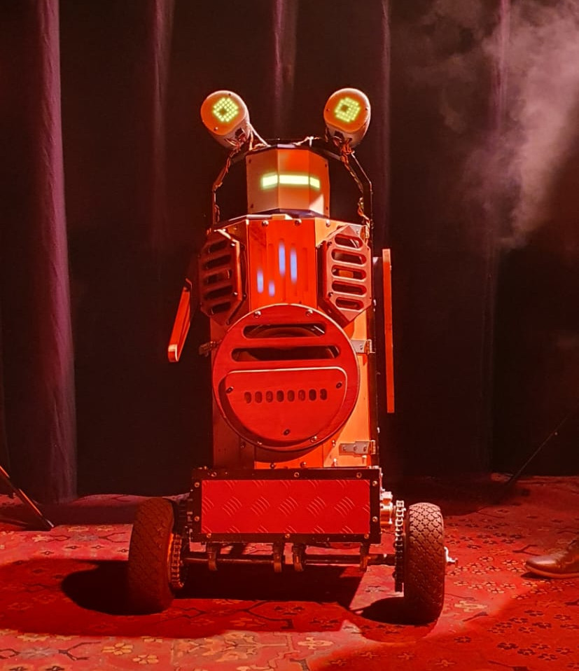
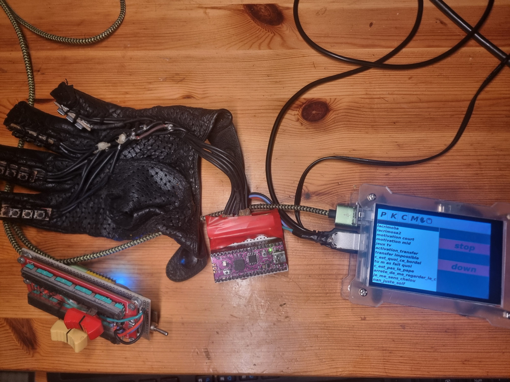

# Dadou Robot


This project is a intent to make a robot for the theater, and street entertainment.
The robot can run sequence of speech with movement, as well accessories, ambient sound, controller and helmet.

## Accessorices
### Helmet

### Controller


## Documentation
This robot is done in Python with the framework ROS2 to run programs in RPI4 and RPI pico mostly

See [`docs/`](docs/) for detailed information:
- [`docs/architecture.md`](docs/architecture.md): software layout and integration with other rep
- [`docs/hardware/overview.md`](docs/hardware/overview.md): physical subsystems and maintenance notes.
- [`docs/software/overview.md`](docs/software/overview.md): ROS nodes, action managers, JSON assets.
- [`docs/interfaces.md`](docs/interfaces.md): ROS topics consumed and produced.
- [`docs/operations.md`](docs/operations.md): deployment and rehearsal procedures.

Related repositories:
- [`../dadou_control_ros`](../dadou_control_ros) — controller inputs and GUI.
- [`../dadou_utils_ros`](../dadou_utils_ros) — shared helpers, logging, deployment scripts.

## Quick Start
```bash
Clone the repository

Make an alias in bashrc
alias r="make -f /[project folder]/dadou_robot_ros/conf/Makefile SERVER=r PROJECT=robot PROJECT_DIR=/home/dadou/Nextcloud/Didier/python/dadou_robot_ros"

Install the rpi4 with pi os lite 64, configure the wifi key and the host name here ros-robot.local

add content in ssh config
host ros-robot-root
        HostName ros-robot.local
        IdentityFile ~/Nextcloud/divers/keys/didier
        User root
        StrictHostKeyChecking no
	    compression yes

launch with r i

```

## Repository Layout
- `robot/`: ROS 2 nodes, action handlers, configuration classes.
- `json/`: Sequences and playlists consumed at runtime.
- `medias/`: Audio and visual assets.
- `conf/`: ROS 2 launch files and deployment helpers.
- `docs/`: Operational documentation.

## Contributing
- Keep configuration values in `robot/robot_config.py` aligned with the physical robot.
- Document new sequences or hardware modules under `docs/`.
- Run unit tests (and hardware tests when possible) located in `robot/tests/`.

## License
To be specified by the project owner.
