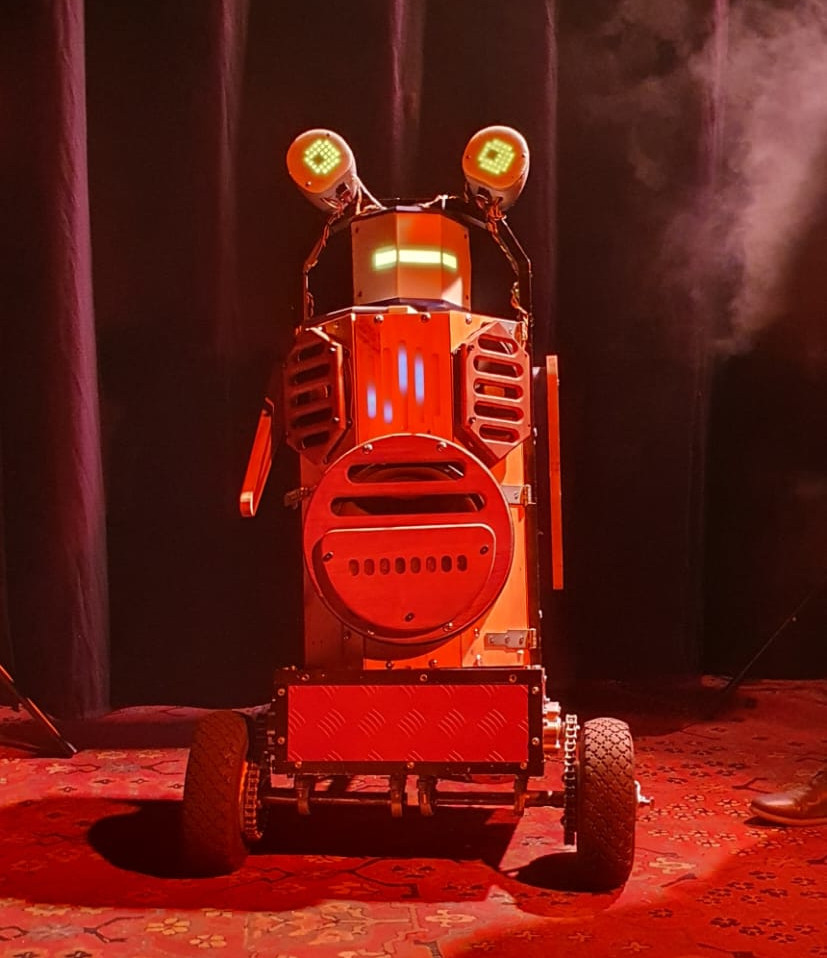
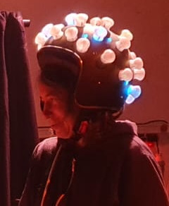
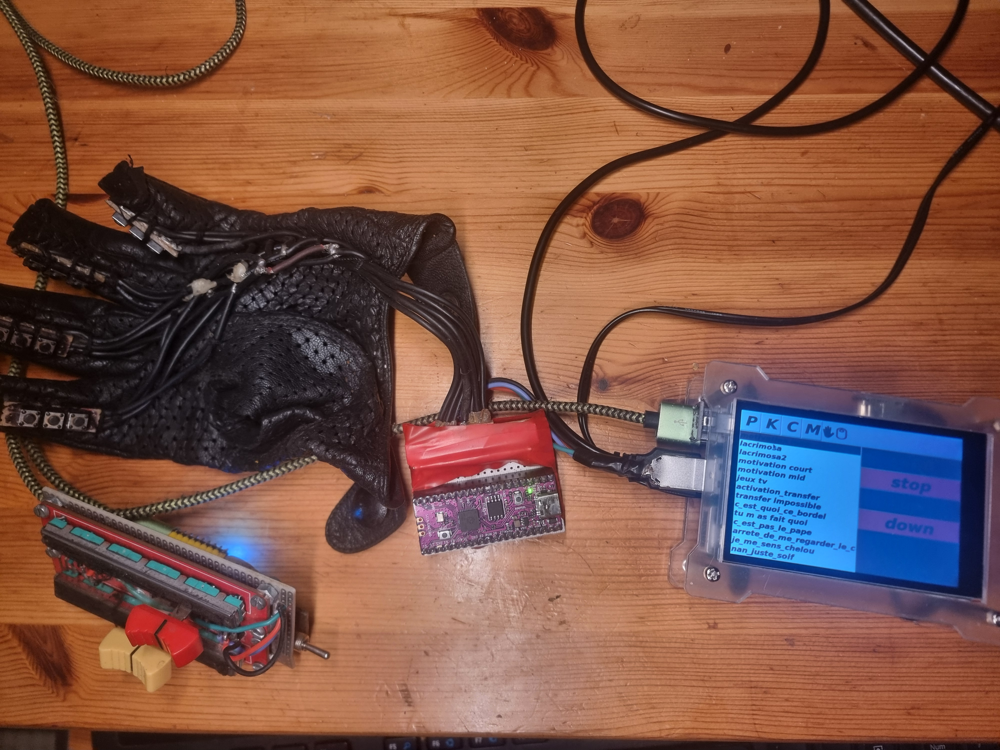

# Dadou Robot


This project aims to build a theatrical and street-performance robot.
The robot plays speech and movement sequences (face, arms, neck, wheels,
lights, audio), reacts to a handheld controller and to a vision Pi, and can be
rehearsed in a Gazebo simulation before touching the real hardware.

## Accessories
### Helmet

### Controller


## Documentation
The runtime is written in Python on top of ROS 2 **Jazzy**, containerised
(Docker) on a Raspberry Pi 4, with a companion vision Pi 5.

See [`docs/`](docs/):
- [`docs/architecture.md`](docs/architecture.md): layers, ROS packages, sim/real boundary, safety.
- [`docs/interfaces.md`](docs/interfaces.md): topics, the `StringTime` + JSON payload contract, drive chain.
- [`docs/software/overview.md`](docs/software/overview.md): code structure, how to extend, tests & CI.
- [`docs/hardware/overview.md`](docs/hardware/overview.md): physical subsystems.
- [`docs/operations.md`](docs/operations.md): deployment, calibration patterns, rehearsal checklists.

Related repositories:
- [`../dadou_control_ros`](../dadou_control_ros) — remote controller.
- [`../dadou_utils_ros`](../dadou_utils_ros) — shared helpers + Ansible deployment.
- `../dadou_vision_ros` — vision / conversation stack (Pi 5).

## Quick start (tests, no hardware needed)
```bash
git clone <repo-url> dadou_robot_ros   # + dadou_utils_ros as sibling (symlinked)
cd dadou_robot_ros
python3 -m venv .venv
.venv/bin/pip install -r requirements-test.txt   # same file as CI
.venv/bin/pytest -q        # 443 unit tests, hardware imports are deferred
```

## Simulation (Gazebo Harmonic, x86)
```bash
cd conf/docker/sim && ANIMATIONS=true docker compose -f docker-compose-sim.yml up -d
# Play an animation in sim (arms/eyes/neck + face):
docker exec dadou-sim-container bash -c 'source /opt/ros/$ROS_DISTRO/setup.sh && source /home/ros2_ws/install/setup.bash && ros2 topic pub --once animation robot_interfaces/msg/StringTime "{msg: \"\\\"parle\\\"\", time: 45000, anim: false}"'
```
`ROS_DOMAIN_ID` separates worlds: 42 = real robot, 43 = simulation.

## Deployment on the robot
```bash
cd conf && make d          # Ansible rsync of the local checkout + build marker
ssh r 'sudo docker restart dadou-robot-container'
```
See [`docs/operations.md`](docs/operations.md) for the full procedure,
calibration patterns and the wheels camera protocol.

## Repository layout
- `robot/`: application — ROS nodes, actions, Track sequencer, LED wiring.
- `conf/ros2_dependencies/`: standalone ROS 2 packages (interfaces, drive
  chain, simulation, URDF, bringup).
- `json/`: sequences, expressions, lights — all under data-contract tests.
- `medias/`: audio and visual assets (face visuals are generated by
  `conf/scripts/generate_expressions.py`).
- `conf/`: Docker, launch, deployment helpers, scripts.
- `docs/`: documentation.

## Contributing
- Safety first: any movement feature must handle its stop case; the wheels
  path requires simulation + camera protocol before ground use.
- Keep the code clean and AI-maintainable: no dead code, one abstraction per
  concept, contracts tested, French comments explaining the WHY.
- Physical acquisitions (wiring, calibration) must be locked by unit tests.
- Run `.venv/bin/pytest -q` before any commit; CI runs it on every push.

## For AI assistants
- Working state and next steps (French): [`CLAUDE.md`](CLAUDE.md)
- Deployment & calibration commands: [`docs/operations.md`](docs/operations.md)
- Topics and payload contract: [`docs/interfaces.md`](docs/interfaces.md)

## License
To be specified by the project owner.
