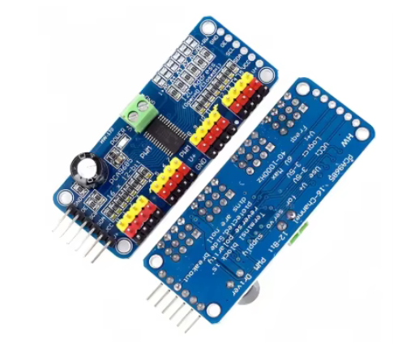
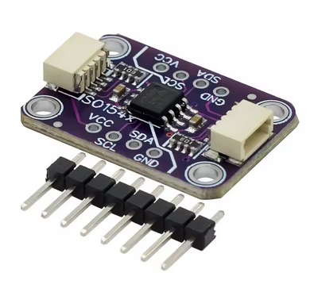
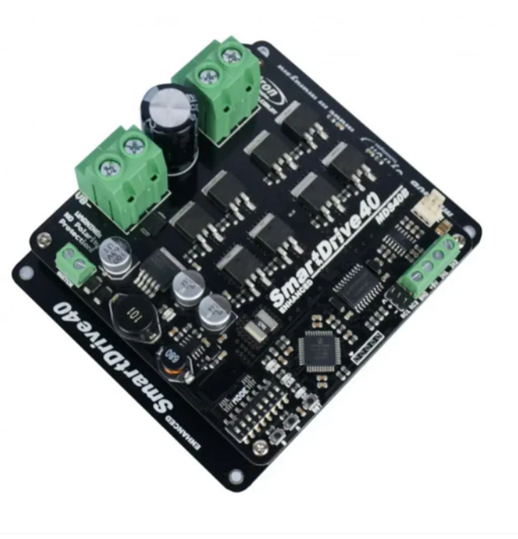
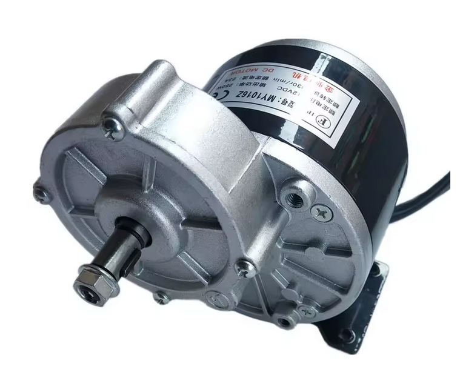
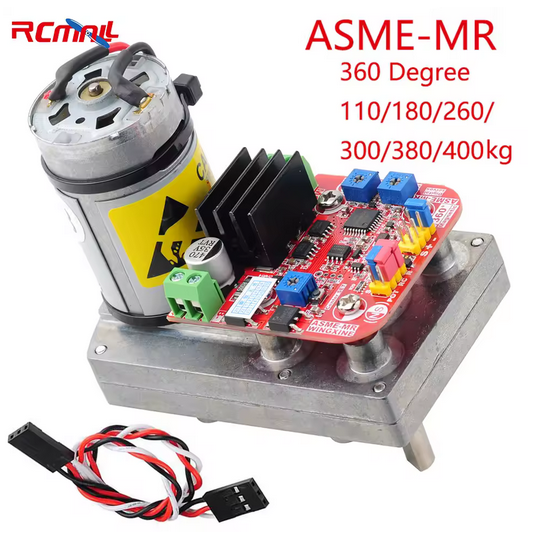
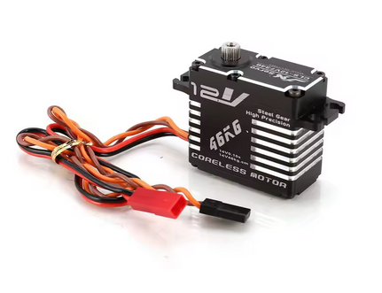
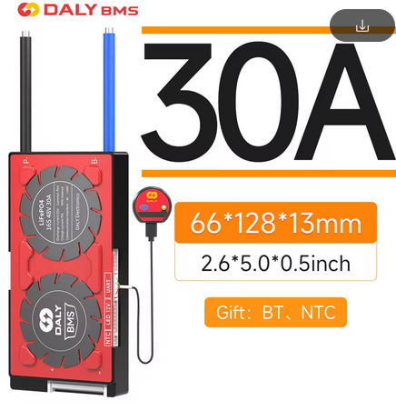
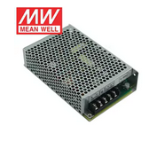
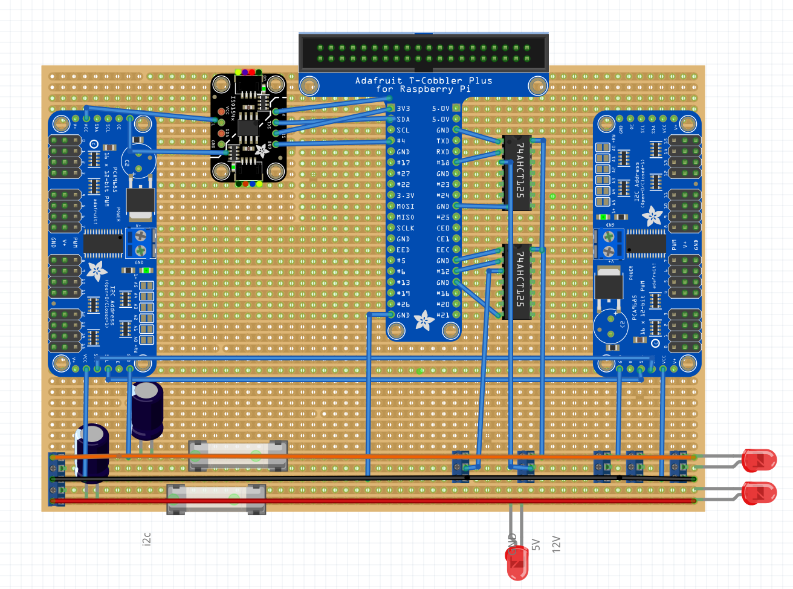
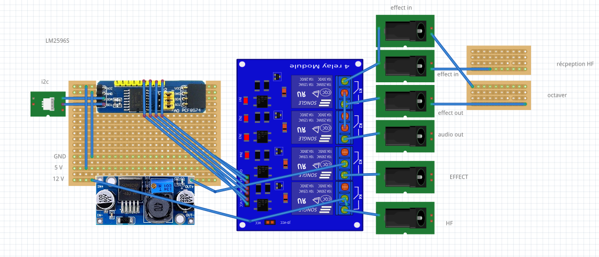

# Hardware Overview

## Physical Specification
- Weight: ~50 kg wood & metal frame
- Mobility: two driven wheels, stabilised by the controller commands
- Upper body: two arms (no hands) with servo actuation
- Head: LED strips for eyes and a removable LED mouth
- Power: ensure the battery/PSU setup is documented in the operations sheet (add details as they evolve)

## Sensors & Inputs
- Serial-connected glove (RP2040) that translates performer gestures
- Optional onboard sensors (I2C accelerometer, etc.) configured through `robot_config.py`

## Devices
All motors are driven by an I2C PCA9685 PWM board attached to the Raspberry Pi 4, reducing wiring complexity and electrical load on the Pi.

*PCA9685 PWM driver board used for the robot actuators.*

The I2C signal from the Pi is isolated with an ISO1540 STEMMA bidirectional isolator to protect the main board.

*ISO1540 I2C isolator between the Raspberry Pi and the actuator bus.*

### Wheels differential drive

*Wheel assemblies and mounting hardware.*

The PWM signal feeds a Cytron SmartDrive 40 A motor driver (10–45 V) that powers the wheel motors.

*Cytron SmartDrive DC motor driver.*

Each wheel uses a 250 W brushless cycle motor.

*Brushless 250 W wheel motor.*

### Arms, eyes and mouth servos
The arms and mouth are controlled by ASME-MR 380 kg·cm continuous-rotation RC servos.

*ASME-MR high-torque servo for arms and mouth.*

The eyes use a JX Servo CLS-12V7346 (46 kg·cm, 12 V).

*JX CLS-12V7346 servo dedicated to the eyes.*

### Power supply
The battery pack is built from 18650 cells rated at 40 C (8×5 configuration, capacity to be confirmed).

A Daly Smart BMS (Li-ion, 7S/8S/16S capable) manages charging and 24 V output for the high-power domain.

*Daly Smart BMS supervising the main battery pack.*

12 V is generated by a Mean Well SD-50B-24 DC/DC converter.

*Mean Well SD-50B-24 converter producing the 12 V rail.*

5 V is generated by a second Mean Well SD-50B-24 configured for 5 V output.

*Mean Well SD-50B-24 converter producing the 5 V rail.*

## Electronics board
Document diagrams, pinouts, and maintenance procedures here. Include photos or links under `docs/hardware/assets/` as they become available.
The main distribution board interfaces the Raspberry Pi with the PWM drivers, LED strips, and matrix through 74AHCT125 level shifters.

*Main electronics board mounted inside the robot.*

*Schematic of the main distribution board (I2C routing, level shifting, LED connectors).*

The audio board manages relays to switch audio sources between wireless receivers and the Raspberry Pi, while also distributing 9 V power to the audio devices.

*Audio board handling source selection and relay control.*

*Schematic of the audio relay board (PCF8574 I/O expander and power regulation).*

## Maintenance Checklist
- Inspect cabling before each performance
- Verify servo calibration after transport
- Confirm LED strips are firmly attached and diffused correctly for stage lighting
- Test emergency stop procedures (describe them in `docs/operations.md`)
