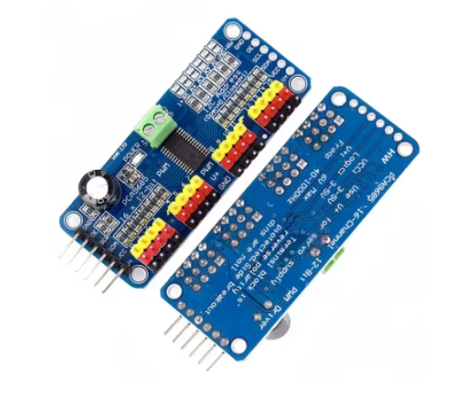
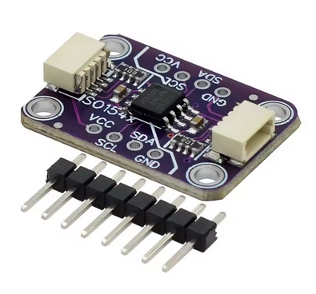
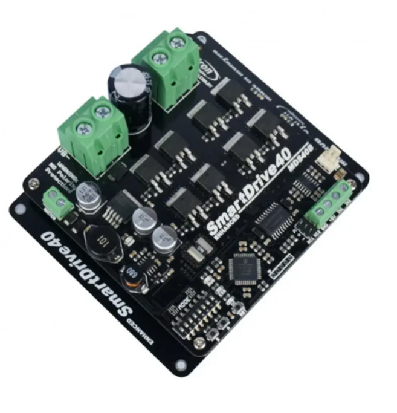
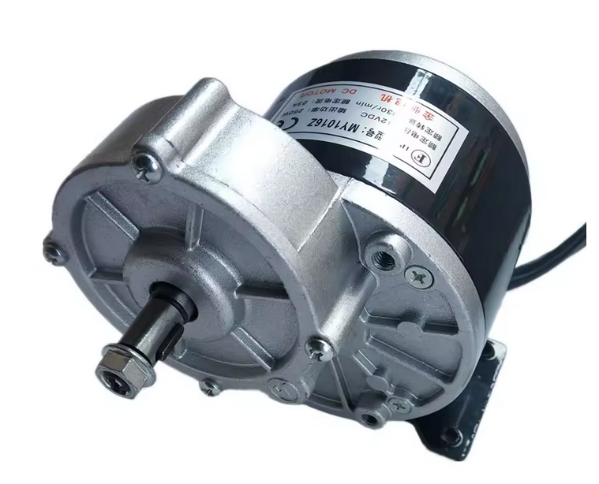
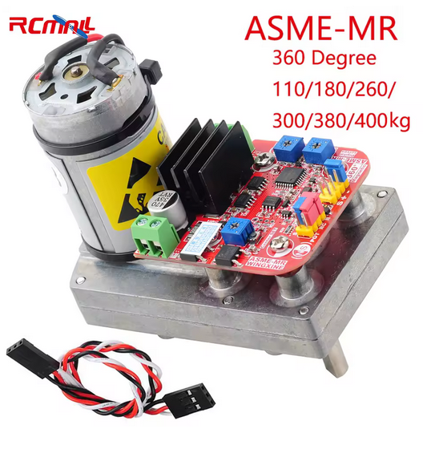
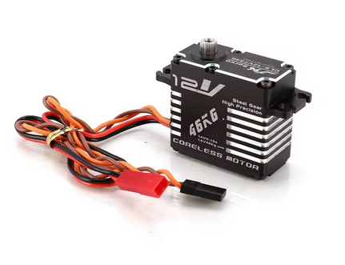
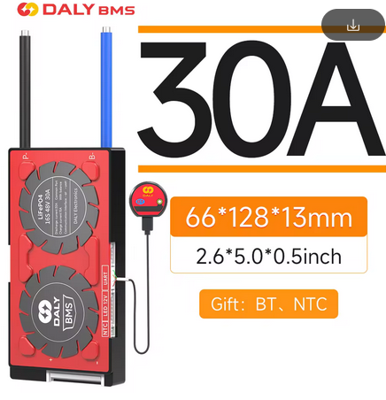
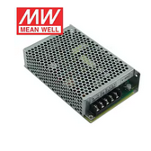
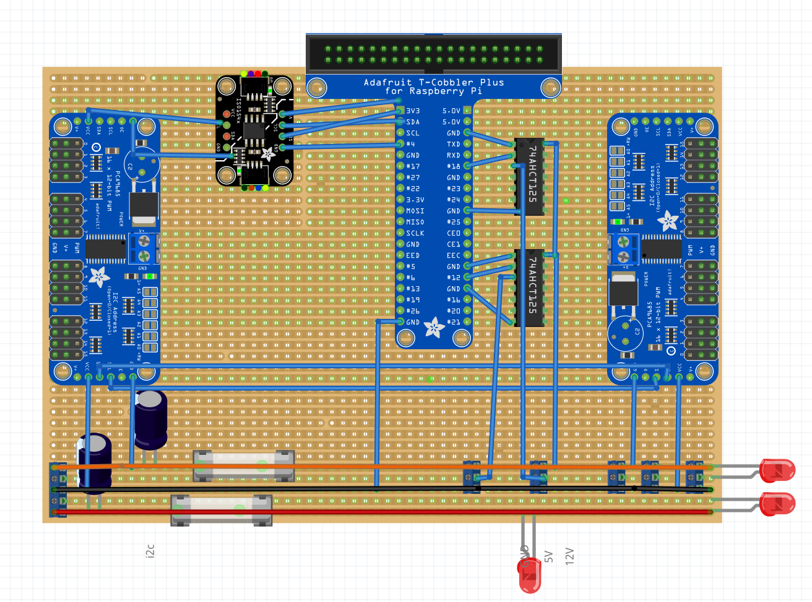
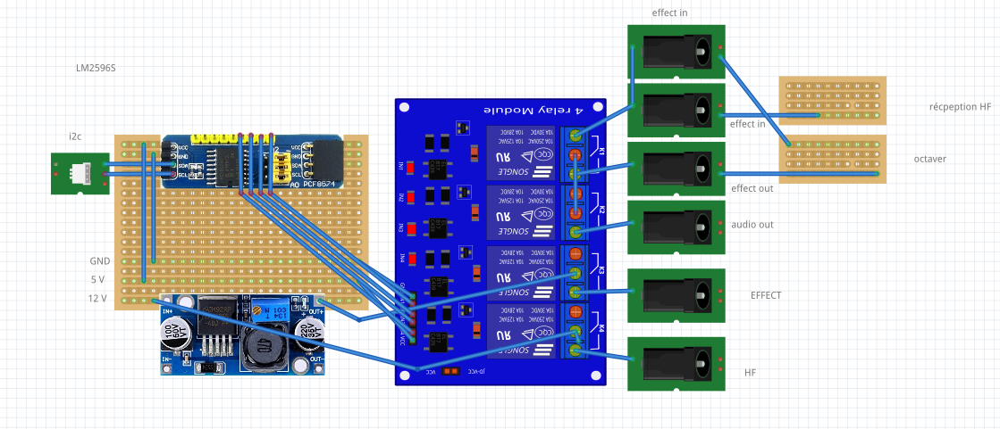

# Hardware Overview

## Physical Specification
- Weight: ~50 kg wood & metal frame
- Mobility: two driven wheels, stabilised by the controller commands
- Upper body: two arms (no hands) with servo actuation
- Head: LED strips for eyes and a removable LED mouth
- Power: ensure the battery/PSU setup is documented in the operations sheet (add details as they evolve)

## Sensors & Inputs
- Serial-connected glove (RP2040) that translates performer gestures
- Optional onboard sensors (I2C accelerometer, etc.) configured through `robot_config.py`

## Vision & camera

### In service: USB webcam
A USB UVC webcam (Jieli chipset) is head-mounted and driven from the **vision Raspberry Pi 5**
(see `../dadou_vision_ros`), captured by OpenCV at 640×480 MJPG in `person_tracker_node.py`.
Three properties are load-bearing and must be known before anyone swaps it out:

- **It caps at 16.7 fps** while MediaPipe only burns 24 % of the CPU. The camera — not the
  compute — is the bottleneck of the perception loop.
- **It is also the microphone.** ALSA alias `casque_mic` → card U20, declared in the vision
  Pi's `/etc/asound.conf`. `chat_node` V2 depends on it. Replacing the webcam with a CSI
  module therefore *requires* buying a separate USB microphone — this is not a like-for-like swap.
- **Its auto-exposure converges slowly** (hence the 15 warm-up frames in `photo-camera.sh`);
  it already falsified the LED face calibration once.

### Evaluated 2026-07-13, not purchased: CSI camera (IMX219 130°)

Candidate module: **IMX219 8 MP, 130° FOV, MINI CSI (22-pin), 15 cm FFC — €9.39**
<https://fr.aliexpress.com/item/1005006912887641.html>

Selection criteria (use these to re-pick if the listing dies — stock was low):

| Criterion | Why it matters here |
| --- | --- |
| **IMX219**, not OV5647 | Sensor of the official Camera Module v2: first-class libcamera support (`dtoverlay=imx219`), and clearly better in low light than the 2013-era OV5647. |
| **22-pin "mini CSI" / "for Pi 5"** | The Pi 5 uses the narrow 22-pin connector. A 15-pin Pi 4 module additionally needs a 15→22 adapter cable. |
| **No IR LEDs / no "night vision"** | Those modules are **NoIR** — no IR-cut filter — which washes colours out to pink under stage light and degrades the very image MediaPipe consumes. Didier never plays in the dark; night vision is a defect here, not a feature. |
| **~130° FOV** | 77° ≈ the current webcam (no gain). 160–200° fisheye distorts so hard that `person_follower`'s bounding-box→heading mapping stops being linear. |

Open points, to settle **before** any purchase or migration:

- **Ribbon length is an ARCHITECTURE constraint, not a shopping detail — 500 mm is a ceiling.**
  CSI-2 is a short-haul differential link (up to 1 Gbit/s per lane). Raspberry Pi only sells
  200 / 300 / 500 mm, and **beyond 1 m it is reported as very unreliable, especially in
  electrically noisy environments** — which is exactly what Didier's chassis is (two 250 W
  brushless motors under PWM, a PA amplifier, LED strips with fast edges). CSI→HDMI→CSI extenders
  exist but are proven for *displays*, not cameras; not a path for touring hardware.

  Consequences, in order:
  - **The USB webcam has no such limit** (3–5 m). Add this to the CSI column of costs, next to the
    lost microphone and the libcamera migration.
  - **The vision Pi 5 must sit in the UPPER TORSO**, as close under the neck as possible — a 30–40
    cm run, well inside the official range. **Not in the head:** a Pi 5 plus cooler is 60–80 g of
    mass added to the neck, and the gaze damping (0.15 / 1.5) was tuned and *validated on the real
    robot on 2026-07-12*. Do not detune a working subsystem for a cabling reason.
  - **Budget the slack loop.** The cable does not run straight: it crosses the neck with the slack
    loop the mount is designed around (see the zip-tie anchors). That eats 5–10 cm.
  - Route **away** from motor and amplifier cables; if a crossing is unavoidable, cross at **90°**,
    never run parallel.

- **The cable: buy it OFFICIAL, not on AliExpress.** The Raspberry Pi camera cable is **shielded**
  (that is in the spec, *never* in the product name — searching for "nappe blindée" finds nothing).
  ~€3.72 at Kubii. AliExpress clones copy the wording; the shielding cannot be verified, and a bad
  cable does not fail cleanly — it fails **intermittently**: perfect on the bench, dropping out in
  the street under vibration when the motors load. That is the worst possible failure mode for a
  touring robot, and saving €3 buys a fault nobody can reproduce. **Take 300 mm, not 500** — shorter
  is less exposed to noise.

- **⚠️ TWO CABLE VARIANTS EXIST, AND THIS IS THE EASY MISTAKE.** The naming is opaque:
  *"Standard"* = 15-way, 1 mm pitch (classic camera boards). *"Mini"* = 22-way, 0.5 mm pitch
  (Pi 5 and Pi Zero).

  | Reference | Connects |
  | --- | --- |
  | **Standard–Mini** | 15-pin camera board → Pi 5 |
  | **Mini–Mini** | 22-pin camera board → Pi 5 |

  The Kubii listing found on 2026-07-13 (`CSI / MIPI camera cable for Raspberry Pi 5`, €3.72) is
  **Mini–Mini** — its own page says *"2 × 22 W, 0.5 mm pitch"* and warns that connecting to 15-way
  connectors *"requires the use of new adapter cables"*. **Look at the connector on the camera board
  itself before ordering.** Getting this wrong buys a cable that cannot be plugged in.
- **Mechanics — the strongest argument for staying on USB.** An FPC ribbon is not designed for
  repeated flexing, and it would cross the *moving neck joint* (gaze pans the head). A USB cable
  with strain relief survives that; a ribbon fatigues and cracks.
- **Software cost is the real price, not the €9.** `cv2.VideoCapture` cannot see a CSI camera on
  Pi 5 / Bookworm — no legacy V4L2 path. It requires libcamera (Picamera2, or the `camera_ros`
  ROS 2 node) **inside the vision Docker container**, with the libcamera stack and tuning files
  baked into the image.
- **Distortion.** Even at 130° there is barrel distortion: a person at the frame edge reads as
  "less off-centre" than they are. The box→heading gain must be **re-checked under the camera
  protocol**, never assumed.
- **A printable mount already exists** (designed 2026-07-13, *not printed*):
  `plans/supports/support-camera-csi/support-camera-csi.scad` in the CAD repo — a protective tray
  holding the board + a screwed base with an arc-slot tilt lock, plus a drill template to print
  first. Three constraints found while designing it, all counter-intuitive, and all imposed by the
  130° field of view:
  - The **tilt axis must sit behind the lens plane**. Putting it at the optical centre (the elegant
    choice) pushes the yoke uprights in front of the lens, and they enter the frame — 67.6° against
    a 65° half-angle.
  - **The board is fully enclosed — back, edges and front — and only the lens sticks out.** The
    rule that makes a front cover safe at 130°: rays entering the lens only ever travel *up and
    outward* from the front element, never back down, so any obstruction whose face stays **below
    the top of the lens barrel**, with an aperture wider than the barrel, hides inside the shadow
    the barrel already casts and cannot vignette. That is a proof, not a margin — and it is enforced
    by an `assert(front_t + cap_lip <= barrel_h)` that has been tested to actually fire and produce
    *no geometry*, so a vignetting cover cannot be exported. Consequence: no screw passes through
    the board and no screw head stands in front of it (the cover's two countersunk screws sit on
    posts outside the board's footprint).
  - The ribbon gets **two zip-tie anchors** so the slack loop flexes with the neck instead of the
    connector — an FPC that cracks at the connector fails *silently*.

  Its module dimensions are the *official Pi Camera v2* footprint and **must be re-measured** on the
  actual clone before printing — three of them are now load-bearing: the lens-holder clearance
  diameter, the **barrel height** (which is what authorises the cover at all), and the board
  thickness. Every other dimension is derived from them, so correcting a measurement recomputes the
  whole part.
- **Two cameras are possible.** The Pi 5 has two CSI/DSI connectors, both usable as cameras at
  once (`cam0` / `cam1`; libcamera can even software-sync their frames). Use case not decided —
  stereo depth would be a project of its own (calibration + rectification), whereas wide+narrow
  or front+rear is realistic. It doubles the ISP/CPU load on a Pi 5 that will also carry whisper
  and piper in V2.

## Distance & obstacle sensing

### In service: none — and the distance we *do* have is monocular
There is **no distance sensor on the robot**. Distance to the tracked person is a **monocular
proxy**: `person_tracker_node` publishes the silhouette **height** [0..1] on `/vision/person_box`,
which `person_follower` regulates against `target_height`. Lot D0 of the conversation study
(`etude-declenchement-conversation.md`) will calibrate that proxy into metres (1.2 / 2.4 / 3.6 m —
Hall's zones — adult *and* child). For "is the person in the social zone", this is enough and it
is free. **Do not buy a sensor for that need — it is already solved.**

The real gap is elsewhere: **nothing detects an obstacle that is not the tracked person.** Today
the safety is the operator on the deadman, which is coherent as long as wheels only roll with the
remote in hand (priority 1). The day the follower rolls without an operator, CLAUDE.md's
non-negotiable rule ("every movement feature MUST handle its stop case") requires a sensor.

### Evaluated 2026-07-13, not purchased: RPLIDAR C1

**Slamtec RPLIDAR C1 — DTOF, 12 m, 360°, 10 Hz, ~680 points/scan, ROS1 & ROS2 — €68.99**
<https://fr.aliexpress.com/item/1005006190309082.html>
(The same sensor is listed elsewhere at €97.69 — check the price before ordering.)

Why a 2D lidar and not the cheap alternatives:

| Sensor | Verdict for Didier |
| --- | --- |
| Ultrasonic (HC-SR04) | **No.** ~30° cone, and clothing (wool, coats) *absorbs* ultrasound — it is blindest to exactly what it must see: people. |
| IR ToF (VL53L1X) | **No.** Stage projectors radiate massive IR; an IR ToF collapses under stage lighting. Sunlight outdoors is worse. |
| **2D lidar (RPLIDAR C1)** | **Yes.** Immune to ambient IR, publishes `sensor_msgs/LaserScan` natively, and would open nav2 later. |

Design constraints, established 2026-07-13 (these are the non-obvious parts):

- **360° coverage is NOT needed, so the robot's structure is not a blocker.** 360° serves SLAM;
  Didier does not do SLAM. What is needed is the **forward arc** (120–180°) so as not to roll over
  a foot. Mount the lidar **low and forward**; the body occludes the rear, which is normal for a
  differential robot. The occluded sector **must be masked** (`laser_filters` /
  `LaserScanAngularBoundsFilter`) or ROS reads it as a permanent obstacle glued to the robot.
- **The design question is the scan HEIGHT, not the coverage.** A 2D lidar sees one slice. Low
  (20–30 cm) sees legs, chair feet, steps — the actual danger of a 50 kg robot in a crowd — but
  misses table tops and outstretched arms. High (~1 m) sees torsos but runs over feet and children.
  **Low and forward is the right choice here.**
- **No autonomous reverse — already enforced in code**, independently of any sensor:
  `follow_control.py` has `allow_reverse = False` ("camera faces forward, reversing is driving
  blind"). A front-facing lidar takes nothing away: the robot still reverses **under the remote**,
  where a human looks behind it. A 50 kg robot reversing autonomously into a crowd is a bad idea
  *with* a rear sensor too. If autonomous reverse is ever wanted, the answer is a **rear contact
  bumper** (a certain safety), not a second lidar (a probable one).
- **The obstacle gate MUST run on the robot Pi 4**, inside the `cmd_vel` chain (next to `twist_mux`
  / `twist_deadman`) — **never on the vision Pi 5**. A safety that depends on the Wi-Fi link between
  the two Pis is not a safety. The lidar therefore plugs into the **Pi 4** over USB.
- **CPU cost is negligible for this use.** 680 points × 10 Hz = ~6.8 k points/s over USB serial.
  The `rplidar_ros` driver costs a few percent of one core; a forward-cone minimum-range gate costs
  under one percent. What *would* be expensive is nav2 (costmap + planners + localisation) — which
  this function does not need and must not need.
- **A contact bumper complements it, it does not replace it.** A lidar only sees its plane; a front
  bumper bar on a micro-switch, wired to a hard stop, catches what the plane misses.

**Removable mount (designed 2026-07-13, printable):**
`plans/supports/support-lidar-c1/support-lidar-c1.scad` in the CAD repo — chassis base plate
(dovetail groove, front stop as the position reference, captive M4 nut) + a sled carrying the
lidar (one vertical thumbscrew; tool-free removal in seconds, repeatable position; the lidar's
four M2.5 stay on the sled forever). Three `assert()` guardrails, one of which already caught a
real mistake (M2.5×8 refused: 6.6 mm engagement > the manufacturer's **4 mm hard limit** that
physically destroys the sensor). All mount features stay below the optical turret — nothing can
cross the scan plane. Dimensions from the Slamtec C1 datasheet v1.0 (±0.2 mm): **re-measure on
the actual unit before printing** (nothing is purchased).

**What if it finally aims lower or higher?** (established with the mount design)
- *Tilt (pitch)* — scan plane at h = 25 cm, tilted **down** by θ: the ground itself appears as an
  obstacle arc at d = h/tan θ → 1° = 14.3 m (beyond the 12 m range: invisible), 2° = 7.2 m,
  5° = 2.9 m, 10° = 1.4 m. For the intended **proximity gate (stop under ~1.5 m)** down-tilt only
  hurts from ~8-10°; print flatness + a sane chassis hold ±2° effortlessly. Tilted **up** by θ the
  plane climbs d·tan θ (+9 cm at 1 m for 5°): still shins. Residual trim = washers under two of
  the four chassis screws — no adjustment mechanism on a part that carries a 10 Hz rotor. A future
  nav2 use (12 m: 1° = 21 cm at range) would justify a v2 part; the mount being removable makes
  swapping trivial.
- *Height* — the mount does not choose it (scan plane = fixation surface + 42.8 mm; aim 25 cm →
  bolt at ~207 mm from the ground). **Lower** (< 15 cm) sees more low obstacles but pulls the
  false-ground closer on any down-tilt (h = 15 cm, 5° → 1.7 m: inside the gate zone); **higher**
  (> 40 cm) misses chairs and seated children. 20-30 cm remains the window — and whatever the
  height, **feet and steps below the plane stay invisible by construction: that is the bumper's
  job**, not a mounting question.

**Not before priority 1** (the on-ground scenic test, remote in hand). That test is what will say
whether the operator-on-deadman is enough for a long while. Buying earlier means designing a
guardrail for a use nobody has observed yet.

## Microphone

### In service: the webcam's microphone
The conversation input is currently the **USB webcam's own microphone** (ALSA alias `casque_mic` →
card U20, declared in the vision Pi's `/etc/asound.conf`). The conversation study
(`etude-declenchement-conversation.md` §5.5) decided: **keep the U20 and MEASURE first** (lot D0:
street-condition recordings replayed through the VAD). Hardware change *only on measured failure*.

Two things make the question real anyway: **switching to the CSI camera removes this microphone**
(a CSI module has no mic), and the study has an unaddressed **echo** problem — Didier speaks loudly
through the mixing desk into speakers while the mic sits on him, so without echo cancellation or a
strict half-duplex he **hears himself and answers himself**. That is exactly the failure mode that
got `chat_node` killed on 2026-07-11.

### Evaluated 2026-07-13, not purchased: ReSpeaker XVF3800 USB 4-Mic Array

**Seeed reSpeaker XVF3800 USB 4-Mic Array (cased USB version) — ~€94 + shipping on AliExpress**
<https://fr.aliexpress.com/item/1005009684208884.html> — also sold by Seeed directly and by EU
resellers; **compare before ordering, AliExpress is not obviously the bargain here** (unlike the lidar).

**Take the XVF3800, not the XVF3000 (ReSpeaker v2.0): XMOS has issued an EOL notice on the
XVF3000** and recommends the XVF3800 for new designs. Do not build Didier's conversation on a
dying chip.

Why an array and not a "good microphone":

- **Distance.** The social zone is 1.2–3.6 m. A lavalier or desktop mic gives Whisper nothing
  usable at 3 m in a noisy street. This is a **far-field** array (4 mics, hardware beamforming,
  ~5 m pickup).
- **Speaker attribution.** The study itself says this needs a mic array. The XVF3800 exposes
  **DoA** (`AEC_AZIMUTH_VALUES` via the `respeaker/reSpeaker_XVF3800_USB_4MIC_ARRAY` host_control
  tool), to be cross-referenced with the camera's person azimuth.
- **Zero CPU.** All DSP runs on its own XMOS chip; it presents as a plain **UAC 2.0** sound card
  (no driver, works as-is in the Docker container with `/dev/snd` already mounted). The Pi 5's CPU
  stays free for Whisper and Piper.

Note that its **AEC is NOT a reason to buy it** — see below. Buy it for the far-field beamforming
and the DoA, or do not buy it.

### Echo: Didier IS the PA — half-duplex is the architecture, not a fallback

The robot's chassis **is the speaker enclosure** (hexagonal body, audio deck, HF receiver, octaver;
`pièces techniques/support-baffle` in the CAD plans). There is no "far from the speakers". This
inverts the naive advice, and it is the single most important audio decision:

- **No AEC can make a PA listen to itself being drowned.** Didier radiates on the order of 100 dB;
  a passer-by at 3 m arrives around 60 dB. That is a 40 dB hole *before* the AEC starts, and an AEC
  buys 20–40 dB of echo return loss. It does not close that gap. **Do not count on it.**
- **Therefore: the mic is armed ONLY while Didier is silent.** Half-duplex is the architecture. It
  costs nothing, needs no hardware, and dissolves the echo problem entirely — when the robot is
  silent the enclosure is not driven, so there is neither airborne nor structure-borne echo left.
- **Do NOT re-route the TTS through the ReSpeaker's output.** That rewiring only existed to feed the
  AEC a reference signal, and the AEC is not load-bearing here. One trap removed.
- **The gate must trigger on "ANY audio source is live", not on "Piper is playing".** Didier has an
  **HF receiver + octaver**: the performer's voice goes out through the robot's body at any moment
  during a show. The audio board already switches sources between the wireless receivers and the Pi
  — **that** is the state to read. A gate that only watches the TTS will let the mic listen while
  the performer is talking through the robot.
- **Add a 300–500 ms hold-off** after audio stops before re-arming the mic, to let street
  reverberation die out.
- **What is genuinely lost is barge-in** (interrupting Didier mid-sentence). It is physically out of
  reach for a robot that is a PA, and it must be accepted. The compensation is **dramaturgical, not
  technical: give Didier SHORT utterances.** If he speaks in short bursts there is always a gap to
  answer in, and nobody feels the need to cut him off.

Traps, in order of how much they would cost to discover late:

- **USB, NEVER an I2S HAT.** Seeed's cheaper ReSpeaker HATs (4-Mic, 6-Mic Circular) need the
  out-of-tree `seeed-voicecard` kernel driver — historically broken at every kernel bump, and
  especially painful on Pi 5. They also squat the GPIO header and push beamforming back onto *our*
  CPU. €40 saved against permanent maintenance debt.
- **Buy the right variant.** The listing also sells a **XIAO / ESP32** version — a dev board driven
  by a microcontroller, *not* meant to plug into a Pi over USB. Take the cased **USB Mic Array**.
- **Ignore the AEC.** Its hardware AEC would need the far-end reference signal (TTS routed *through*
  the ReSpeaker's output), and it would still not work — see the half-duplex section above. Buying
  this array for its AEC would be buying a function that cannot help a robot which *is* the PA.

### Mounting (design constraints, decided 2026-07-13)

The cased array is a ~13 × 14 × 5 cm puck, 300 g. How it is fixed decides whether it works at all:

- **On the BODY, not the head — and this is the non-obvious one.** The array has a fixed 0°
  reference direction, and its DoA is expressed in *its own* frame. Mounted on the head, that frame
  **rotates with the gaze**, so every azimuth would have to be composed with the live neck angle.
  Mounted on the torso, the frame is fixed and the DoA is directly usable. Body mounting also keeps
  the mic away from the neck/eye servos (the loudest structure-borne noise sources at standstill)
  and avoids yet another cable flexing across a moving joint.
- **Decouple it mechanically. A rigid bolt-down is the classic mistake.** Screwed hard to a 50 kg
  wood/metal frame carrying 250 W brushless motors and servos, the array picks up **structure-borne**
  noise — motor whine, servo gear chatter — which no beamformer can remove, because it does not
  arrive through the air. Mount on silicone/neoprene grommets or foam standoffs (a poor man's shock
  mount); nylon screws, deliberately **not** overtightened.
- **Clear acoustic path, mic plane roughly horizontal.** The 4 capsules sit in a circle on the top
  face and the DoA depends on that geometry. Burying the puck behind a grille, a fabric, or in a
  cavity kills the beamforming and the DoA (cavity resonance). It needs to *see* the air.
- **Note the mounting angle.** Whatever rotation you bolt it at becomes a **fixed offset** on every
  DoA reading. Measure it once, write it in the config — do not discover it during a show.
- **Forget "far from the speakers" — there is no far.** The chassis is the enclosure. Echo is not
  solved by placement, it is solved by half-duplex (above). Placement only has to solve *motor and
  servo* noise, which is why decoupling and body-mounting matter and distance-to-speaker does not.
  If any part of the frame is *not* a radiating baffle panel, prefer it.
- **Height ~1.2–1.5 m** (upper torso), aimed at people's heads, not at their knees.
- Its **12-LED ring shows the DoA** — potentially a listening signal for the public, but the LED
  face already plays that role; do not let it contradict the face.

## Devices
All motors are driven by an I2C PCA9685 PWM board attached to the Raspberry Pi 4, reducing wiring complexity and electrical load on the Pi.

*PCA9685 PWM driver board used for the robot actuators.*

The I2C signal from the Pi is isolated with an ISO1540 STEMMA bidirectional isolator to protect the main board.

*ISO1540 I2C isolator between the Raspberry Pi and the actuator bus.*

### Wheels differential drive

*Wheel assemblies and mounting hardware.*

The PWM signal feeds a Cytron SmartDrive 40 A motor driver (10–45 V) that powers the wheel motors.

*Cytron SmartDrive DC motor driver.*

Each wheel uses a 250 W brushless cycle motor.

*Brushless 250 W wheel motor.*

### Arms, eyes and mouth servos
The arms and mouth are controlled by ASME-MR 380 kg·cm continuous-rotation RC servos.

*ASME-MR high-torque servo for arms and mouth.*

The eyes use a JX Servo CLS-12V7346 (46 kg·cm, 12 V).

*JX CLS-12V7346 servo dedicated to the eyes.*

### Power supply
The battery pack is built from 18650 cells rated at 40 C (8×5 configuration, capacity to be confirmed).

A Daly Smart BMS (Li-ion, 7S/8S/16S capable) manages charging and 24 V output for the high-power domain.

*Daly Smart BMS supervising the main battery pack.*

12 V is generated by a Mean Well SD-50B-24 DC/DC converter.

*Mean Well SD-50B-24 converter producing the 12 V rail.*

5 V is generated by a second Mean Well SD-50B-24 configured for 5 V output.

*Mean Well SD-50B-24 converter producing the 5 V rail.*

## Electronics board
Document diagrams, pinouts, and maintenance procedures here. Include photos or links under `docs/hardware/assets/` as they become available.
The main distribution board interfaces the Raspberry Pi with the PWM drivers, LED strips, and matrix through 74AHCT125 level shifters.

*Main electronics board mounted inside the robot.*

*Schematic of the main distribution board (I2C routing, level shifting, LED connectors).*

The audio board manages relays to switch audio sources between wireless receivers and the Raspberry Pi, while also distributing 9 V power to the audio devices.

*Audio board handling source selection and relay control.*

*Schematic of the audio relay board (PCF8574 I/O expander and power regulation).*

## Maintenance Checklist
- Inspect cabling before each performance
- Verify servo calibration after transport
- Confirm LED strips are firmly attached and diffused correctly for stage lighting
- Test emergency stop procedures (describe them in `docs/operations.md`)
