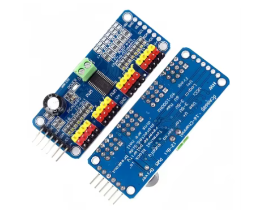
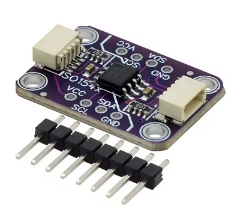
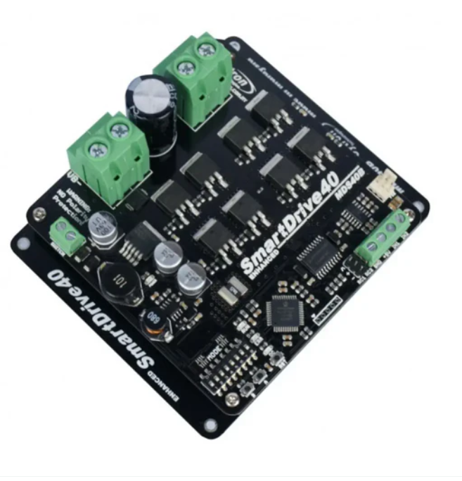
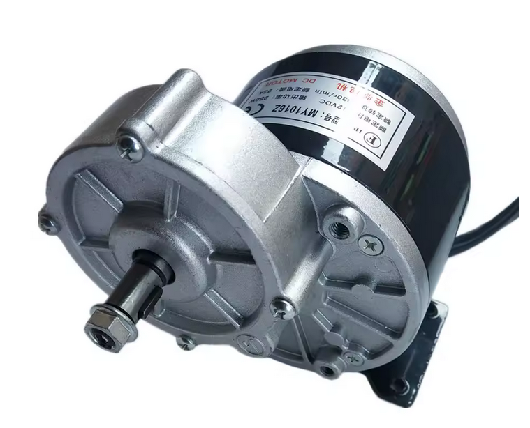
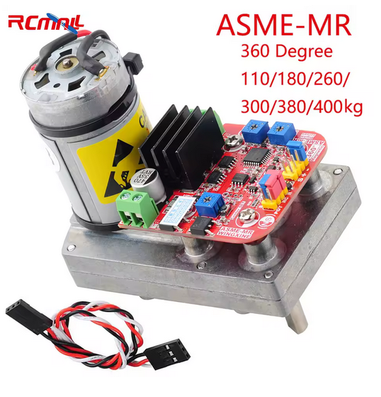
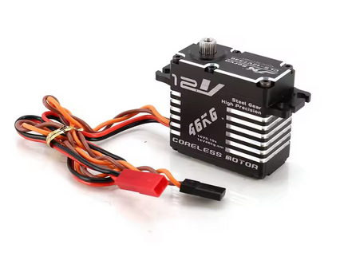
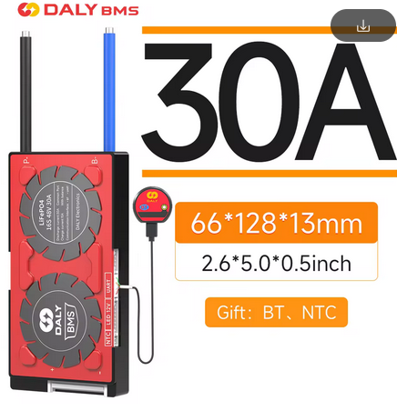
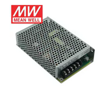
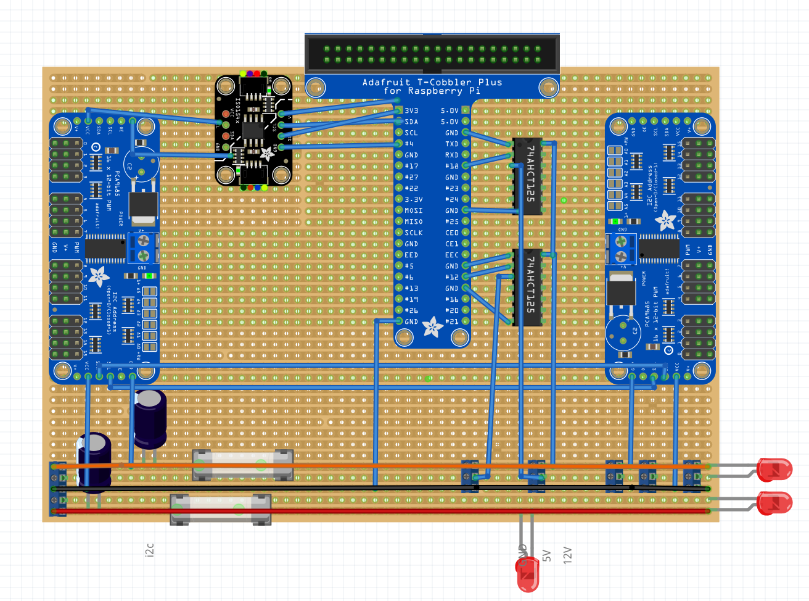
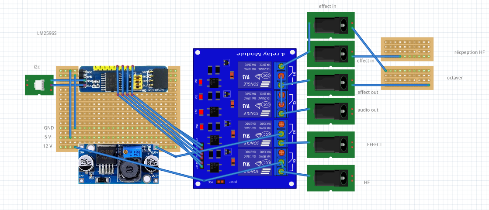

# Hardware Overview

## Physical Specification
- Weight: ~50 kg wood & metal frame
- Mobility: two driven wheels, stabilised by the controller commands
- Upper body: two arms (no hands) with servo actuation
- Head: LED strips for eyes and a removable LED mouth
- Power: ensure the battery/PSU setup is documented in the operations sheet (add details as they evolve)

## Sensors & Inputs
- Serial-connected glove (RP2040) that translates performer gestures
- Optional onboard sensors (I2C accelerometer, etc.) configured through `robot_config.py`

## Vision & camera

### In service: USB webcam
A USB UVC webcam (Jieli chipset) is head-mounted and driven from the **vision Raspberry Pi 5**
(see `../dadou_vision_ros`), captured by OpenCV at 640×480 MJPG in `person_tracker_node.py`.
Three properties are load-bearing and must be known before anyone swaps it out:

- **It caps at 16.7 fps** while MediaPipe only burns 24 % of the CPU. The camera — not the
  compute — is the bottleneck of the perception loop.
- **It is also the microphone.** ALSA alias `casque_mic` → card U20, declared in the vision
  Pi's `/etc/asound.conf`. `chat_node` V2 depends on it. Replacing the webcam with a CSI
  module therefore *requires* buying a separate USB microphone — this is not a like-for-like swap.
- **Its auto-exposure converges slowly** (hence the 15 warm-up frames in `photo-camera.sh`);
  it already falsified the LED face calibration once.

### Evaluated 2026-07-13, not purchased: CSI camera (IMX219 130°)

Candidate module: **IMX219 8 MP, 130° FOV, MINI CSI (22-pin), 15 cm FFC — €9.39**
<https://fr.aliexpress.com/item/1005006912887641.html>

Selection criteria (use these to re-pick if the listing dies — stock was low):

| Criterion | Why it matters here |
| --- | --- |
| **IMX219**, not OV5647 | Sensor of the official Camera Module v2: first-class libcamera support (`dtoverlay=imx219`), and clearly better in low light than the 2013-era OV5647. |
| **22-pin "mini CSI" / "for Pi 5"** | The Pi 5 uses the narrow 22-pin connector. A 15-pin Pi 4 module additionally needs a 15→22 adapter cable. |
| **No IR LEDs / no "night vision"** | Those modules are **NoIR** — no IR-cut filter — which washes colours out to pink under stage light and degrades the very image MediaPipe consumes. Didier never plays in the dark; night vision is a defect here, not a feature. |
| **~130° FOV** | 77° ≈ the current webcam (no gain). 160–200° fisheye distorts so hard that `person_follower`'s bounding-box→heading mapping stops being linear. |

Open points, to settle **before** any purchase or migration:

- **Ribbon length is an ARCHITECTURE constraint, not a shopping detail — 500 mm is a ceiling.**
  CSI-2 is a short-haul differential link (up to 1 Gbit/s per lane). Raspberry Pi only sells
  200 / 300 / 500 mm, and **beyond 1 m it is reported as very unreliable, especially in
  electrically noisy environments** — which is exactly what Didier's chassis is (two 250 W
  brushed motors under PWM (whose brushes arc), a PA amplifier, LED strips with fast edges). CSI→HDMI→CSI extenders
  exist but are proven for *displays*, not cameras; not a path for touring hardware.

  Consequences, in order:
  - **The USB webcam has no such limit** (3–5 m). Add this to the CSI column of costs, next to the
    lost microphone and the libcamera migration.
  - **The vision Pi 5 must sit in the UPPER TORSO**, as close under the neck as possible — a 30–40
    cm run, well inside the official range. **Not in the head:** a Pi 5 plus cooler is 60–80 g of
    mass added to the neck, and the gaze damping (0.15 / 1.5) was tuned and *validated on the real
    robot on 2026-07-12*. Do not detune a working subsystem for a cabling reason.
  - **Budget the slack loop.** The cable does not run straight: it crosses the neck with the slack
    loop the mount is designed around (see the zip-tie anchors). That eats 5–10 cm.
  - Route **away** from motor and amplifier cables; if a crossing is unavoidable, cross at **90°**,
    never run parallel.

- **The cable: buy it OFFICIAL, not on AliExpress.** The Raspberry Pi camera cable is **shielded**
  (that is in the spec, *never* in the product name — searching for "nappe blindée" finds nothing).
  ~€3.72 at Kubii. AliExpress clones copy the wording; the shielding cannot be verified, and a bad
  cable does not fail cleanly — it fails **intermittently**: perfect on the bench, dropping out in
  the street under vibration when the motors load. That is the worst possible failure mode for a
  touring robot, and saving €3 buys a fault nobody can reproduce. **Take 300 mm, not 500** — shorter
  is less exposed to noise.

- **⚠️ TWO CABLE VARIANTS EXIST, AND THIS IS THE EASY MISTAKE.** The naming is opaque:
  *"Standard"* = 15-way, 1 mm pitch (classic camera boards). *"Mini"* = 22-way, 0.5 mm pitch
  (Pi 5 and Pi Zero).

  | Reference | Connects |
  | --- | --- |
  | **Standard–Mini** | 15-pin camera board → Pi 5 |
  | **Mini–Mini** | 22-pin camera board → Pi 5 |

  The Kubii listing found on 2026-07-13 (`CSI / MIPI camera cable for Raspberry Pi 5`, €3.72) is
  **Mini–Mini** — its own page says *"2 × 22 W, 0.5 mm pitch"* and warns that connecting to 15-way
  connectors *"requires the use of new adapter cables"*. **Look at the connector on the camera board
  itself before ordering.** Getting this wrong buys a cable that cannot be plugged in.
- **Mechanics — the strongest argument for staying on USB.** An FPC ribbon is not designed for
  repeated flexing, and it would cross the *moving neck joint* (gaze pans the head). A USB cable
  with strain relief survives that; a ribbon fatigues and cracks.
- **Software cost is the real price, not the €9.** `cv2.VideoCapture` cannot see a CSI camera on
  Pi 5 / Bookworm — no legacy V4L2 path. It requires libcamera (Picamera2, or the `camera_ros`
  ROS 2 node) **inside the vision Docker container**, with the libcamera stack and tuning files
  baked into the image.
- **Distortion.** Even at 130° there is barrel distortion: a person at the frame edge reads as
  "less off-centre" than they are. The box→heading gain must be **re-checked under the camera
  protocol**, never assumed.
- **A printable mount already exists** (designed 2026-07-13, *not printed*):
  `plans/supports/support-camera-csi/support-camera-csi.scad` in the CAD repo — a protective tray
  holding the board + a screwed base with an arc-slot tilt lock, plus a drill template to print
  first. Three constraints found while designing it, all counter-intuitive, and all imposed by the
  130° field of view:
  - The **tilt axis must sit behind the lens plane**. Putting it at the optical centre (the elegant
    choice) pushes the yoke uprights in front of the lens, and they enter the frame — 67.6° against
    a 65° half-angle.
  - **The board is fully enclosed — back, edges and front — and only the lens sticks out.** The
    rule that makes a front cover safe at 130°: rays entering the lens only ever travel *up and
    outward* from the front element, never back down, so any obstruction whose face stays **below
    the top of the lens barrel**, with an aperture wider than the barrel, hides inside the shadow
    the barrel already casts and cannot vignette. That is a proof, not a margin — and it is enforced
    by an `assert(front_t + cap_lip <= barrel_h)` that has been tested to actually fire and produce
    *no geometry*, so a vignetting cover cannot be exported. Consequence: no screw passes through
    the board and no screw head stands in front of it (the cover's two countersunk screws sit on
    posts outside the board's footprint).
  - The ribbon gets **two zip-tie anchors** so the slack loop flexes with the neck instead of the
    connector — an FPC that cracks at the connector fails *silently*.

  Its module dimensions are the *official Pi Camera v2* footprint and **must be re-measured** on the
  actual clone before printing — three of them are now load-bearing: the lens-holder clearance
  diameter, the **barrel height** (which is what authorises the cover at all), and the board
  thickness. Every other dimension is derived from them, so correcting a measurement recomputes the
  whole part.
- **Two cameras are possible.** The Pi 5 has two CSI/DSI connectors, both usable as cameras at
  once (`cam0` / `cam1`; libcamera can even software-sync their frames). Use case not decided —
  stereo depth would be a project of its own (calibration + rectification), whereas wide+narrow
  or front+rear is realistic. It doubles the ISP/CPU load on a Pi 5 that will also carry whisper
  and piper in V2.

## Distance & obstacle sensing

### In service: none — and the distance we *do* have is monocular
There is **no distance sensor on the robot**. Distance to the tracked person is a **monocular
proxy**: `person_tracker_node` publishes the silhouette **height** [0..1] on `/vision/person_box`,
which `person_follower` regulates against `target_height`. Lot D0 of the conversation study
(`etude-declenchement-conversation.md`) will calibrate that proxy into metres (1.2 / 2.4 / 3.6 m —
Hall's zones — adult *and* child). For "is the person in the social zone", this is enough and it
is free. **Do not buy a sensor for that need — it is already solved.**

The real gap is elsewhere: **nothing detects an obstacle that is not the tracked person.** Today
the safety is the operator on the deadman, which is coherent as long as wheels only roll with the
remote in hand (priority 1). The day the follower rolls without an operator, CLAUDE.md's
non-negotiable rule ("every movement feature MUST handle its stop case") requires a sensor.

### Evaluated 2026-07-13, not purchased: RPLIDAR C1

**Slamtec RPLIDAR C1 — DTOF, 12 m, 360°, 5 kHz sampling, 8-12 Hz, 0.72° → 500 points/scan
at 10 Hz, min range 0.05 m, ROS1 & ROS2 — €68.99**
<https://fr.aliexpress.com/item/1005006190309082.html>
(The same sensor is listed elsewhere at €97.69 — check the price before ordering. Still ~€68 on
2026-08-26.)

Why a 2D lidar and not the cheap alternatives:

| Sensor | Verdict for Didier |
| --- | --- |
| Ultrasonic (HC-SR04) | **No.** ~30° cone, and clothing (wool, coats) *absorbs* ultrasound — it is blindest to exactly what it must see: people. |
| IR ToF (VL53L1X) | **No.** Stage projectors radiate massive IR; an IR ToF collapses under stage lighting. Sunlight outdoors is worse. |
| Depth camera (RealSense, OAK-D) | **Still no, but on weaker grounds than this row used to claim** (revised 2026-08-27). The old reason — "it lands on the Pi 5, i.e. behind the Wi-Fi link, which disqualifies it as a safety" — **rested on a false premise**: both Pis are RJ45 to the on-board router once properly wired. What remains is cost (€150-300 vs €69), a Pi 5 that already carries whisper + TTS + vision, and the fact that its one real advantage over a 2D lidar (it sees a *volume*, not a plane) is answered here by the contact bumper. See the in-line-enforcement + heartbeat rule below. |
| 3D lidar (Livox Mid-360 & co.) | **No — and "the Pi 5 can't" is NOT the reason** (asked 2026-08-27). On paper a Pi 5 can drive one: an Ethernet lidar at ~200 k pts/s is only ~25 Mbit/s, and the driver is packet parsing. Nor is it "behind the Wi-Fi link" — **that premise was false and was retracted the same day**: both Pis are RJ45 to the on-board router once properly wired. What remains is the workload: the cloud lands on the **vision Pi 5** (the Pi 4 cannot chew 3D at all), and that Pi already carries whisper + TTS + vision — 3D LIO/SLAM is not a spare-cycles workload. Plus the in-line-enforcement + heartbeat rule below, which applies to any gate computed off-board. **The honest counter-argument, stated so nobody thinks we missed it:** a 3D lidar with a built-in IMU running FAST-LIO *does* produce 6-DoF odometry, which is precisely the gap the wheels leave. But that costs €600+ against ~€40 of wheel encoders whose firmware is **already written** (`firmware/pico_odometry`, 2026-08-20) — and Didier needs a **proximity barrier**, not SLAM. Revisit only if the encoder route actually fails. |
| **2D lidar (RPLIDAR C1)** | **Yes.** Immune to ambient IR, publishes `sensor_msgs/LaserScan` natively, and would open nav2 later. |

**Selection criterion that outranks the sensor itself: a MAINTAINED ROS 2 driver.** This is a safety
function; the driver is not a detail one writes over a weekend. `rplidar_ros` is published by
Slamtec, ROS 1 + ROS 2, used by thousands. Beware the cheaper 360° DTOFs that look identical on
paper — see the buying trap below.

**⚠️ BUYING TRAP, seen 2026-08-26.** The AliExpress listing above is titled *"SLAMTEC RPLIDAR
**C1 / D6**"* and has two variants. The €48 price shown by default is the **D6**, whose package
insert reads *"CHINA SCIENCE PHOTON CHIP COIN-D6"* — a Guoke Optical Core sensor, **not a Slamtec**.
That family is not junk (its COIN-D4 is ROBOTIS's LDS-03 on the TurtleBot3, with the
`ROBOTIS-GIT/coin_d4_driver` package), but the **D6 has no public datasheet and no maintained ROS 2
driver** — €20 saved against writing a serial driver for an undocumented frame format, on the
safety path of a 50 kg robot. **Select the "C1 Lidar" variant (€67.99) and check the price actually
changes.** Also check the USB-UART adapter is included *for that variant*: the C1 is a UART sensor
and the shipment-list photo may only document the D6 bundle.

Design constraints, established 2026-07-13 (these are the non-obvious parts):

- **360° coverage is NOT needed, so the robot's structure is not a blocker.** 360° serves SLAM;
  Didier does not do SLAM. What is needed is the **forward arc** (120–180°) so as not to roll over
  a foot. Mount the lidar **low and forward**; the body occludes the rear, which is normal for a
  differential robot. The occluded sector **must be masked** (`laser_filters` /
  `LaserScanAngularBoundsFilter`) or ROS reads it as a permanent obstacle glued to the robot.
- **The design question is the scan HEIGHT, not the coverage.** A 2D lidar sees one slice. Low
  (20–30 cm) sees legs, chair feet, steps — the actual danger of a 50 kg robot in a crowd — but
  misses table tops and outstretched arms. High (~1 m) sees torsos but runs over feet and children.
  **Low and forward is the right choice here.**
- **No autonomous reverse — already enforced in code**, independently of any sensor:
  `follow_control.py` has `allow_reverse = False` ("camera faces forward, reversing is driving
  blind"). A front-facing lidar takes nothing away: the robot still reverses **under the remote**,
  where a human looks behind it. A 50 kg robot reversing autonomously into a crowd is a bad idea
  *with* a rear sensor too. If autonomous reverse is ever wanted, the answer is a **rear contact
  bumper** (a certain safety), not a second lidar (a probable one).
- **The obstacle gate must be ENFORCED in-line on the robot Pi 4** — inside the `cmd_vel` chain,
  next to `twist_mux` / `twist_deadman`. The lidar plugs into the **Pi 4** over USB.

  ⚠️ **Reasoning corrected 2026-08-27, because the premise was wrong.** This bullet used to read
  "never on the vision Pi 5 — a safety that depends on the Wi-Fi link between the two Pis is not a
  safety". David: **once properly wired, both Pis are on RJ45 to the on-board router; only the
  remote is Wi-Fi.** So the radio objection dissolves, and with it the *decisive* argument that had
  been reused to reject the depth camera and the 3D lidar. What actually matters is not the medium,
  it is **how the veto fails**:

  - **A gate that is an in-line FILTER is fail-safe**: kill it and the chain breaks, `twist_deadman`
    sees silence and zeros the wheels in 400 ms. (Measured on the real robot 2026-07-04: 440 ms.)
  - **A gate that merely PUBLISHES a veto is not**: kill it and no veto is ever published, so the
    robot happily keeps obeying the remote and stops seeing obstacles — **silently**. That is the
    real trap, and it is independent of Wi-Fi versus copper.

  So the rule that survives: **whatever computes the veto, the thing that enforces it sits in-line
  on the Pi 4, and it must demand a positive heartbeat** ("alive and clear"), never infer safety
  from the absence of a veto. Under that rule a *remote* gate on the Pi 5 becomes admissible.

  Residual reasons to still prefer the sensor on the Pi 4, now honestly ranked as *lesser*:
  the chain gains a router that shares the robot's power rails (a brown-out on 250 W motor inrush
  reboots it), and the Pi 5 is the machine most likely to throttle or OOM since it carries whisper +
  TTS + vision. Both failures are **nuisance stops, not accidents** — a different risk class from
  what this bullet used to claim.
- **CPU cost is negligible for this use.** 5 k points/s over USB serial (the datasheet sampling
  rate; 500 points per scan at 10 Hz — an earlier revision of this page said 680, which contradicted
  the 0.72° resolution: 360 / 0.72 = 500).
  The `rplidar_ros` driver costs a few percent of one core; a forward-cone minimum-range gate costs
  under one percent. What *would* be expensive is nav2 (costmap + planners + localisation) — which
  this function does not need and must not need.
- **A contact bumper complements it, it does not replace it.** A lidar only sees its plane; a front
  bumper bar on a micro-switch, wired to a hard stop, catches what the plane misses.
- **NOT on the head hoop, next to the microphone** (asked 2026-08-27, answered no). Beyond the scan
  height above: a lidar is **a motor spinning continuously at 10 Hz**, and that hoop was chosen as
  the *quietest fixed point on the robot* for the mic. Bolting a rotor to it would undo the whole
  decoupling design — and note the asymmetry that makes this worse than it looks: **the mic's
  suspension only fights structure-borne noise; against the airborne whine of a rotor 10 cm from the
  capsules it does nothing at all.** Standing rule for that hoop: nothing that spins, nothing that
  vibrates.

**Removable mount (designed 2026-07-13, revised 2026-07-14, printable — v3):**
`plans/supports/support-lidar-c1/support-lidar-c1.scad` in the CAD repo. At 20-30 cm the robot
only offers a **vertical face — and that face is not plumb**, which drives the whole design.
Three printed parts:
- **Wall plate**, stays on the robot for good: 12 mm flat plate with a vertical dovetail groove,
  held by **four captive M4 nuts in hex pockets on its FRONT face** — the screws come from *inside*
  the robot through the panel, nothing visible on the stage side, and the wall face stays perfectly
  flat (a nut pocket at the panel interface would both drop its nut during fitting and skew the
  aim). It can be printed as a **wedge** (`panneau_angle`) if the panel leans more than the tilt
  range.
- **Yoke** (back + two cheeks): drops onto the dovetail **from above**, gravity seats it on the
  bottom stop, one thumbscrew locks it.
- **Cradle**: the lidar platform, hinged between the cheeks on a **pivot**, locked by two
  thumbscrews riding in **arc slots — ±20° of hand-set pitch**. This is where the scan plane is
  brought level, at fitting time, with a spirit level on the lidar's cap, robot on its wheels.
  The two arc screws *clamp cheek against lug*: friction holds the attitude, no screw in bending —
  same principle as the camera mount, so nothing springy sits under a 10 Hz rotor.

Yoke + cradle + lidar lift off as one block in ten seconds; off-season only the flat plate remains
(nothing at shin height). The lidar's four M2.5 stay on the cradle forever. `assert()` guardrails,
several of which caught real mistakes: M2.5×8 refused (6.6 mm engagement > the manufacturer's
**4 mm hard limit**, which physically destroys the sensor); every nut pocket must keep ≥ 3 mm of
material in front of it (the v2 plate left 0.6 mm — a skin that splits on the first firm turn);
and **the scan plane is re-checked at BOTH ends of the tilt range** (nose-up tips the plane back
towards the yoke — current margins: 14.5 mm over the back, 10.1 mm over the plate). Note an M4 nut
is **7.0 mm across flats**, not 7.66 (that is across corners — a v2 error that would have let the
nuts spin). Dimensions from the Slamtec C1 datasheet v1.0 (±0.2 mm): **re-measure on the actual
unit before printing** (nothing is purchased). Beam sits 64.8 mm above the plate's bottom edge →
for a 25 cm scan, mount the plate at ~185 mm from the ground.

**What if it finally aims lower or higher?** (this analysis is what sizes the adjustment)
- *Tilt (pitch)* — scan plane at h = 25 cm, tilted **down** by θ: the ground itself appears as an
  obstacle arc at d = h/tan θ → 1° = 14.3 m (beyond the 12 m range: invisible), 2° = 7.2 m,
  5° = 2.9 m, 10° = 1.4 m. For the intended **proximity gate (stop under ~1.5 m)** down-tilt only
  hurts from ~8-10°, so aiming to **±2° is plenty** — which a hand-set arc slot achieves easily.
  Tilted **up** by θ the plane climbs d·tan θ (+9 cm at 1 m for 5°): still shins. What this
  tolerance does **not** cover is a mounting face that is out of plumb by 10-20°: washers cannot
  trim that, hence the pivot. A future nav2 use (12 m: 1° = 21 cm at range) would need an aiming
  target, not another part.
- *Height* — the mount does not choose it (beam = plate bottom + 64.8 mm; aim 25 cm →
  bolt the plate at ~185 mm from the ground). **Lower** (< 15 cm) sees more low obstacles but pulls
  the false-ground closer on any down-tilt (h = 15 cm, 5° → 1.7 m: inside the gate zone); **higher**
  (> 40 cm) misses chairs and seated children. 20-30 cm remains the window — and whatever the
  height, **feet and steps below the plane stay invisible by construction: that is the bumper's
  job**, not a mounting question.

**Not before priority 1** (the on-ground scenic test, remote in hand). That test is what will say
whether the operator-on-deadman is enough for a long while. Buying earlier means designing a
guardrail for a use nobody has observed yet.

## Microphone

### ⚠️ Incident 2026-08-26: the webcam had been unplugged (resolved same day)
While testing the new array, the vision Pi was found with **no USB webcam at all** — `lsusb`
listed only the ReSpeaker and the C-Media adapter, and `v4l2-ctl` showed only the Pi's own ISP
nodes. It had gone unnoticed because nothing was running that needed it: the `casque_mic` alias
pointed at a `CARD=U20` that no longer existed (any `chat_node` V2 start would have failed on
device-open), and **`person_follower` and the gaze had no input either**. David replugged it the
same day — `/dev/video0` and `card 2: U20` are back, the alias works again.

Worth keeping in mind as a failure mode: **a USB device silently disappearing degrades two
subsystems at once here** (vision *and* conversation), and nothing reports it. The telediagnostic
black box is the right place to notice it — a "cameras/mics present" check costs nothing.

### Superseded: the webcam's microphone
The conversation input **was** the **USB webcam's own microphone** (ALSA alias `casque_mic` →
card U20, declared in the vision Pi's `/etc/asound.conf`). The conversation study
(`etude-declenchement-conversation.md` §5.5) decided: **keep the U20 and MEASURE first** (lot D0:
street-condition recordings replayed through the VAD). Hardware change *only on measured failure*.

Two things make the question real anyway: **switching to the CSI camera removes this microphone**
(a CSI module has no mic), and the study has an unaddressed **echo** problem — Didier speaks loudly
through the mixing desk into speakers while the mic sits on him, so without echo cancellation or a
strict half-duplex he **hears himself and answers himself**. That is exactly the failure mode that
got `chat_node` killed on 2026-07-11.

### Ordered 2026-08-12: ReSpeaker XVF3800 4-Mic Circular Array — "Standard" variant

**Ordered:** Seeed reSpeaker XMOS XVF3800 4-Mic Circular Array, **"Standard" variant (no XIAO /
ESP32, no case) — €66.39** (AliExpress item 1005009578368362, seller "Seeedstudio AI Hardware").
Cheaper than the ~€94 first quoted; a body-mounted **3D-printed open support** replaces the cased
version (design constraints below).

Originally evaluated 2026-07-13 (~€94 *cased* version, item 1005009684208884, also sold by Seeed
directly / by EU resellers). The reasoning below — why an array and not a "good microphone" — is
unchanged.

#### RECEIVED and bench-tested on the vision Pi 5 — 2026-08-26

Test run over SSH on the Pi 5 (array mounted **on the robot, robot at rest**), files kept in
`~/pi/mic_test/` on the vision Pi. What was actually verified, and what was not:

| Claim from the purchase file | Measured 2026-08-26 | Verdict |
| --- | --- | --- |
| Driverless UAC 2.0 | `card 0: Array [reSpeaker XVF3800 4-Mic Array]`, enumerated at boot, `snd-usb-audio`, **no driver, no config** | ✅ confirmed |
| 16 kHz, ideal for Whisper | `hw:0,0` advertises exactly **S16_LE / 16000 Hz / 2 ch** — and *nothing else* (single format, single rate) | ✅ confirmed |
| Far-field pickup in the social zone | Speech at **3 m**: −32 dBFS RMS / −12 dBFS peak against a **−53 dBFS** noise floor (robot at rest, chassis closed) → **≈ 21 dB SNR** | ✅ confirmed |
| Usable by the ASR at that distance | `faster-whisper base` (int8, the model already cached in the vision container) transcribes the 3 m take in French, **RTF 0.39** (3.9 s for 10 s audio, +2.6 s model load) | ✅ usable |
| DoA (`AEC_AZIMUTH_VALUES`) | **TESTED the same day** — see the DoA section below | ✅ confirmed |

Two findings that were not in the purchase file:

- **The 2 channels are two DISTINCT signals, not a duplicated mono** (cross-correlation 0.95, peak
  at **0 sample delay** — so it is not a stereo pair carrying an inter-channel time difference,
  which is expected: the beamforming already collapsed the array). Levels differ by ~2 dB and the
  per-second profiles diverge. Which one is the processed beam and which is a reference is **not
  yet identified** — settle it before wiring the ASR to a fixed channel rather than to a downmix.
- **Whisper `base` is the weak link, not the microphone.** The 3 m take came back as
  *"Salut dis-il !"* for « Salut Didier ! », and the second half degraded. The audio is there;
  `base` is simply the smallest model. Try `small` before blaming the capture — and note this
  falsifies nothing about the array, but it does mean **the D0 VAD/ASR measurements must state
  which model they ran**.

Still open after this test (none of it is a capture problem): the **mounting** (decoupling,
bottom-firing air gap, fixed azimuth offset — see below), the **half-duplex gate**, and the
**dimensions to re-measure** before drawing the 3D support.

#### DoA and the LED ring — tested 2026-08-26, `xvf_host` installed on the vision Pi

**Tool.** `host_control/rpi_64bit` from `respeaker/reSpeaker_XVF3800_USB_4MIC_ARRAY` — an ARM64
build exists (the wiki page only lists win32 / linux_x86_64 / mac_arm64; the repo also ships
`rpi_64bit` and `jetson`). Installed in `~/xvf_host/` on the vision Pi: the `xvf_host` binary plus
`libcommand_map.so`, `libdevice_usb.so`, `libdevice_i2c.so`, `transport_config.yaml`. USB is the
default transport, **no `--use` flag needed**; it must run as **root** (raw HID access). Firmware
reported: `VERSION 2 0 6`.

**DoA works, and here is how to read it.** `AEC_AZIMUTH_VALUES` returns **four** angles (rad and
deg): focused beam 1, focused beam 2, free-running beam, auto-selected beam. Measured with a
speaker standing clearly to the robot's **right**, 12 samples over ~10 s:

- **value 1 (focused beam 1)** — locked at **114.4°** and stayed there: the stable read.
- **value 2 (focused beam 2)** — **exactly 90.00°, in silence AND in speech**. It is a constant,
  **not a measurement**. Do not consume it. (This is the trap: it looks like a plausible angle.)
- **value 3 (free-running beam)** — hovered around 80° but threw two wild outliers (3.96°, 359.26°)
  inside 10 s of continuous speech. **Reactive and noisy — never use raw**; it needs the same kind
  of damping the gaze already has.
- **value 4 (auto-selected)** — what drives the LED ring; it tracked beam 1 then switched to the
  free beam (98–105°).

Baseline in silence was 189.6 / 90.0 / 334.9 / 334.9 — so the angles genuinely moved with the
voice. **For cross-referencing with the camera's person azimuth, take value 1 (or value 4), never
value 2, and damp value 3.** The absolute convention (where the array's 0° points) is meaningless
until the board is bolted down — that is the "fixed offset" warning below, still open.

**The LED ring is the DoA display, and it is controllable.** Default state as shipped:
`LED_EFFECT 4` (= DoA), `LED_COLOR 8256` (= `0x2040`, the dark blue), `LED_BRIGHTNESS 127`. The
moving **green** LED is the auto-selected beam. Commands: `LED_EFFECT` 0–4 (off / breath / rainbow
/ single colour / DoA), `LED_COLOR` hex, `LED_BRIGHTNESS` 0–255, `LED_SPEED`. `GPO_WRITE_VALUE 33 0`
cuts power to the WS2812 ring entirely; `GPO_WRITE_VALUE 30 1` is the mute LED.

**⚠️ Tested trade-off — the ring cannot be both custom-coloured and a DoA display.** Writing
`LED_COLOR 0xff2000` while in `LED_EFFECT 4` changed **nothing** on the ring (verified visually):
in DoA mode the colours are fixed (blue base, green marker). The colour only applies in *breath*
and *single-colour* modes — switching to `LED_EFFECT 3` did turn the ring solid orange, **and the
green DoA marker disappeared**. So the decision is binary, and it is a *dramaturgical* one:
either the ring stays a diagnostic instrument (blue/green, not tunable), or it becomes a coloured
stage light that says nothing. David's leaning on 2026-08-26: **keep it lit** — to be re-decided
once the array is mounted on the body and its glow can be judged against the LED face.

**DONE 2026-08-26 — the array is now the conversation microphone.** `/etc/asound.conf` on the
vision Pi re-points the `casque_mic` alias to `CARD=Array` (the alias *name* is a contract with
`vision_config.py::chat_mic_device` — the slave changed, the name did not, so no code change and
`dadou_vision_ros` stays frozen). A `webcam_mic` → `CARD=U20` alias was added to keep the old
capture available for the D0 A/B comparison. Verified from *inside* the container: recording
through `casque_mic` puts `Array` in `state: RUNNING` and leaves `U20` `closed`. Full procedure,
and the bind-mount/inode trap that goes with editing that file, in
[`operations.md`](../operations.md).

**Take the XVF3800, not the XVF3000 (ReSpeaker v2.0): XMOS has issued an EOL notice on the
XVF3000** and recommends the XVF3800 for new designs. Do not build Didier's conversation on a
dying chip.

Why an array and not a "good microphone":

- **Distance.** The social zone is 1.2–3.6 m. A lavalier or desktop mic gives Whisper nothing
  usable at 3 m in a noisy street. This is a **far-field** array (4 mics, hardware beamforming,
  ~5 m pickup).
- **Speaker attribution.** The study itself says this needs a mic array. The XVF3800 exposes
  **DoA** (`AEC_AZIMUTH_VALUES` via the `respeaker/reSpeaker_XVF3800_USB_4MIC_ARRAY` host_control
  tool), to be cross-referenced with the camera's person azimuth.
- **Zero CPU.** All DSP runs on its own XMOS chip; it presents as a plain **UAC 2.0** sound card
  (no driver, works as-is in the Docker container with `/dev/snd` already mounted). The Pi 5's CPU
  stays free for Whisper and Piper.

Note that its **AEC is NOT a reason to buy it** — see below. Buy it for the far-field beamforming
and the DoA, or do not buy it.

### Confirmed from the product page (2026-08-12) — the "Standard" (non-XIAO) is the right variant

The listing's own spec resolves the earlier "is USB-C enough?" doubt and pins the variant:

- **USB Audio Class 2.0, driverless — confirmed.** The page states the reSpeaker XVF3800 *without*
  XIAO ships with **factory USB-audio firmware**, and that it connects **"via USB Audio Class 2.0 …
  no driver required"**. So the **"Standard" variant (no XIAO, no ESP32)** is the one to buy: it
  enumerates as a UAC 2.0 sound card in the container, exactly like the current webcam mic. The USB-C
  connector shape proves nothing — the *firmware* is what carries UAC audio, and here it does.
- **⚠️ NEVER a XIAO / ESP32 variant.** Those ship with **I2S firmware** for MCU integration, and the
  two firmwares are **mutually incompatible** — a XIAO board gives NO USB audio at all. This confirms
  the I2S-HAT warning above: the only USB-audio path is the non-XIAO Standard.
- **DoA is present** (speaker attribution stays possible — the whole reason to pick an array).
- **16 kHz max sample rate — not a limitation, it is ideal.** Whisper wants 16 kHz mono; the array
  outputs exactly that.
- **Ignore, as already planned:** the on-board **AEC** (we stay half-duplex — Didier IS the PA) and
  the board's **speaker / 3.5 mm jack output** (do not re-route the TTS through it).
- **⚠️ Dimensions to re-measure on arrival.** The page lists "35×86 mm", which fits neither a circular
  array nor the ~13×14 cm cased puck — likely the bare board or a spec typo. Measure the real diameter,
  the four mic-port positions and the fixing holes before drawing the 3D support.

### Echo: Didier IS the PA — half-duplex is the architecture, not a fallback

#### ✅ MEASURED 2026-08-26 — the argument below is now a number, and it is worse than argued

First test with the amplifier connected. Didier played his own recorded voice through
`mixette` → amp while the ReSpeaker recorded, **at moderate volume** (C-Media output at 30 %,
amp deliberately not at show level — so **every figure here is a FLOOR**):

| | level at the mic |
| --- | --- |
| silence, amp powered on | **−60.0 dBFS** |
| Didier speaking through his own PA | **−10.4 dBFS** |
| *(reference)* a human speaking at 3 m | −32.4 dBFS |

- **+49.5 dB of self-noise** over silence, and **22 dB ABOVE a human at 3 m** — at *moderate*
  volume. The passer-by is not merely masked, they are 22 dB under. At show level the gap widens.
- **The microphone input CLIPS on Didier's own voice**: peak −0.0 dBFS, 65 saturated samples.
  This kills the "maybe the AEC helps a bit" hope for good — **an AEC needs a linear path**, and a
  clipped input is not linear. There is nothing left to subtract.
- **Whisper transcribed Didier himself** — 7 segments off that recording. This is not a theory
  about a failure mode: it *is* the 2026-07-11 failure, reproduced on demand. Without the gate,
  `chat_node` feeds itself its own speech and answers itself.

**Conclusion: half-duplex is not "the prudent choice", it is the only one.** The gate is now the
single blocking item before `chat_node` V2 can run on real hardware.

The reasoning that predicted this, kept as written:

The robot's chassis **is the speaker enclosure** (hexagonal body, audio deck, HF receiver, octaver;
`pièces techniques/support-baffle` in the CAD plans). There is no "far from the speakers". This
inverts the naive advice, and it is the single most important audio decision:

- **No AEC can make a PA listen to itself being drowned.** Didier radiates on the order of 100 dB;
  a passer-by at 3 m arrives around 60 dB. That is a 40 dB hole *before* the AEC starts, and an AEC
  buys 20–40 dB of echo return loss. It does not close that gap. **Do not count on it.**
- **Therefore: the mic is armed ONLY while Didier is silent.** Half-duplex is the architecture. It
  costs nothing, needs no hardware, and dissolves the echo problem entirely — when the robot is
  silent the enclosure is not driven, so there is neither airborne nor structure-borne echo left.
- **Do NOT re-route the TTS through the ReSpeaker's output.** That rewiring only existed to feed the
  AEC a reference signal, and the AEC is not load-bearing here. One trap removed.
- **The gate must trigger on "ANY audio source is live", not on "Piper is playing".** Didier has an
  **HF receiver + octaver**: the performer's voice goes out through the robot's body at any moment
  during a show. The audio board already switches sources between the wireless receivers and the Pi
  — **that** is the state to read. A gate that only watches the TTS will let the mic listen while
  the performer is talking through the robot.
- **Add a 300–500 ms hold-off** after audio stops before re-arming the mic, to let street
  reverberation die out.
- **What is genuinely lost is barge-in** (interrupting Didier mid-sentence). It is physically out of
  reach for a robot that is a PA, and it must be accepted. The compensation is **dramaturgical, not
  technical: give Didier SHORT utterances.** If he speaks in short bursts there is always a gap to
  answer in, and nobody feels the need to cut him off.

Traps, in order of how much they would cost to discover late:

- **USB, NEVER an I2S HAT.** Seeed's cheaper ReSpeaker HATs (4-Mic, 6-Mic Circular) need the
  out-of-tree `seeed-voicecard` kernel driver — historically broken at every kernel bump, and
  especially painful on Pi 5. They also squat the GPIO header and push beamforming back onto *our*
  CPU. €40 saved against permanent maintenance debt.
- **Buy the right variant.** The listing also sells a **XIAO / ESP32** version — a dev board driven
  by a microcontroller, *not* meant to plug into a Pi over USB. Take the cased **USB Mic Array**.
- **Ignore the AEC.** Its hardware AEC would need the far-end reference signal (TTS routed *through*
  the ReSpeaker's output), and it would still not work — see the half-duplex section above. Buying
  this array for its AEC would be buying a function that cannot help a robot which *is* the PA.

### Audio chain noise — intermittent mains hum, characterised 2026-08-26

David: *"il y a un gros bruit de fond de l'ampli"*, *"ça vient de temps en temps"*, and
*"l'isolation et le bruit du son a été un vrai problème avec ce robot"*. Characterised at the
microphone while it was audible, then it stopped on its own (**intermittent — this matters, a
5 s capture can miss it entirely**).

**It is a hum, not hiss.** With the DSP-free webcam mic, amp on vs amp off, same mic, same room:

| band | amp ON | amp OFF |
| --- | --- | --- |
| 50 Hz | −53.2 dBFS | −64.9 dBFS |
| **150 Hz** | **−49.8** | −74.0 |
| 250–500 Hz (lines at 350 and 450) | ~−47 | −63.7 |
| 2–8 kHz (where hiss would live) | −78.1 | −77.4 — **unchanged** |

Energy sits on **50 Hz and its ODD harmonics** (150, 350, 450) and the treble is untouched: that is
the signature of a **mains-related loop**, not of an amplifier that hisses.

**⚠️ What this measurement does NOT say: where the noise enters.** It says the noise is
mains-related and appears with the amp on. Nothing more. Suspects remain the Pi's PSU, the mixing
desk's PSU, the HF receiver, or another appliance on the same circuit — and the shape (weak 50 Hz,
strong 150/350/450) points more at a **transformer/rectifier buzz** than at pure capacitive leakage.

David's fair objection, worth writing down because it is the crux: *"how can it come from the
mains when the Pi 5's power supply hasn't changed?"* **A ground loop is a property of the CIRCUIT,
not of one device.** Nothing changed on the Pi — the **amplifier** arrived, and it closed the loop.
A class-II switching PSU has **Y-capacitors** between mains and its output ground; by design they
inject a small 50 Hz leakage current into the powered device's ground. As long as that ground goes
nowhere, it is invisible. Connect it to another earthed device *through an audio cable* and the
current finally has a path — through the cable shield, where it becomes audible. So "the PSU has
not changed" and "the PSU is a suspect" are both true: what changed is the **path**, not the source.

**Two free tests, to run the day the hum is actually audible** (it is intermittent):

1. Unplug the Pi's *audio* cable from the mixing desk, amp still on. Hum gone → it enters through
   the Pi path. Hum stays → it is on the amp / desk / HF side.
2. Run the Pi from a **battery**. Hum gone → the PSU is confirmed.

**⚠️ Two methodological traps, both hit on the day:**

- **The ReSpeaker is the WRONG instrument for this.** Its DSP suppresses *stationary* noise — which
  is exactly what a hum is. It reported −59.1 dBFS while the DSP-free webcam mic reported −40.7 on
  the same noise: **an 18 dB blind spot**. Always cross-check chain noise with a mic that has no
  processing (that is one reason the `webcam_mic` alias was kept).
- **A global RMS lies when anything clicks.** The first amp-off capture read −28.6 dBFS overall
  while every band above 45 Hz sat below −68: a switch click / handling thump, sub-45 Hz, dominated
  the average. Use a **median of 100 ms blocks** (permanent noise) plus a p90 (peaks), and always
  print a per-second profile. `~/mic_test/bruit.py` on the vision Pi does this.

**Next step — the USB oscilloscope (David has a Hantek).** It is the right instrument: it sees the
hum *on the wire*, before it becomes sound, and separates "noise enters the chain" from "the amp
amplifies it". Probe, in order: (1) line level at the mixing-desk output with the Pi connected and
silent; (2) the same with the Pi's audio cable unplugged — if the hum dies, the loop comes through
the Pi path; (3) ripple on the Pi's 5 V supply.

> **⚠️ Safety, non-negotiable.** A USB scope's ground is bonded to the PC's USB ground, hence
> usually to **mains earth**. Clipping the probe ground onto the amp's or the Pi's ground does not
> *measure* the ground loop — it **creates** one, and can earth a floating point through the probe.
> Line-level signals only; never a floating chassis, never anything mains-side. If the two grounds
> must be compared, that needs a differential probe or an isolated input, not a ground clip.

Lesson recorded for a **next robot** (single star ground, isolation transformer or balanced/DI
input between computer and amp, a clean computer PSU, and keep one DSP-free mic on board purely as
a measuring instrument). **Landed 2026-08-27** in the triangle concept —
`concepts/triangle-3roues/README.md` in the CAD repo, section « Contraintes rapatriées de Didier »
§2 — together with the rest of that day's retro-fit (mic/DoA validity conditions, the in-line
veto + positive-heartbeat rule, the motor-inrush brown-out, and the reopened 3D-sensor question).
Worth knowing there: that robot runs **off a battery, no earth**, so this particular loop cannot
exist — what replaces it is switching noise from three VESCs sharing the 48 V rail.

### Mounting (design constraints, decided 2026-07-13)

The cased array is a ~13 × 14 × 5 cm puck, 300 g. How it is fixed decides whether it works at all:

> **Design study written 2026-08-27** (we bought the *bare* board, so the support is ours to print):
> `plans/supports/support-respeaker-xvf3800/README.md` — three parts, the decoupling worked out as a
> number, and the 8 dimensions still to be taken with a caliper before anything is drawn.
> **The headline finding: an off-the-shelf rubber grommet mount would AMPLIFY servo noise, not cut
> it** (f0 = 159 Hz on a ~30 g board → +4.7 dB at 200 Hz). Soft foam + ballast, not rubber. And the
> USB cable is a rigid bridge that silently short-circuits any decoupling unless it has a slack loop.
>
> **Location settled 2026-08-27: flat on the steel hoop that arches over the head.** *(Two
> corrections made 2026-08-29, both from measuring instead of assuming: the bar is a **30 × 21
> rectangular tube, 2 mm wall** — not the "T-section" this page claimed — and the board is
> **Ø 99.8 mm**, not the ~70 assumed, the vendor's "35 × 86 mm" being simply wrong. Details and
> consequences: `supports/support-respeaker-xvf3800/README.md` in the CAD repo.)*
> A first idea — vertical on the chest, between the two small speakers — was dropped, and *why* is
> the useful part: a **planar array only resolves direction inside its own plane**. Mounted
> vertically the azimuth becomes a mix of left/right and elevation, **undefined dead ahead** (all
> four mics equidistant on the normal — the commonest conversation case) and front/back ambiguous.
> Not "less accurate": *no longer meaning what it claims* — the same trap as the constant 90.00°
> `value 2`. Pickup would have been fine either way; what was at stake was the DoA.
>
> The hoop satisfies both validity conditions at once — the array lies **horizontal**, and the hoop
> **does not rotate** (it carries the eyes and is fixed to the body; the *head* pans under it). So
> **the DoA is preserved**, and the LED ring becomes an honest signal again: a halo that turns
> toward whoever speaks. Bonus: bottom-firing ports with **literally nothing underneath** — free air,
> 360° — which makes the whole "air gap under the board" constraint trivial; the cable never crosses
> a moving joint; and it is the point furthest from the wheel motors. **The risk it creates:** the
> **eye servos are on that same steel bar, centimetres away** — clamp at the top of the hoop,
> midway between them, and settle it with the §4 measurement.
>
> **On TOP of the crossbar, not under it** (settled 27/08): the hoop's crossbar passes level with
> the top of the head and the **neck axle occupies the space beneath it**. Mounting on top costs
> nothing in height — the eye pods already stand **~15 cm above the crossbar**, and the whole stack
> is ~40 mm, so the eyes stay the robot's high point. It also lets the head pan freely. Two things
> to watch: a rain cap becomes necessary (make it the lantern — a 360° slot lets the ring shine, and
> here the ring means something), and **the bar now sits under the acoustic ports** — check the port
> circle is wider than the bar, or it plugs a mic.
>
> **Both checks cleared 2026-08-29, by measurement.** The bar is 30 mm wide (±15 mm off centre)
> against ports on a Ø 90.4 circle → **30.2 mm of clearance**. And the bar being a *hollow* tube
> (30 × 21, 2 mm wall), a self-drilling screw breaks through into the void: its tip never protrudes
> underneath, where the eye harnesses run and the head pivots. That killed the two-shell clamp — a
> screwed-down plate is simpler, cannot slide, and pins the DoA offset for good.

- **On the BODY, not the head — and this is the non-obvious one.** The array has a fixed 0°
  reference direction, and its DoA is expressed in *its own* frame. Mounted on the head, that frame
  **rotates with the gaze**, so every azimuth would have to be composed with the live neck angle.
  Mounted on the torso, the frame is fixed and the DoA is directly usable. Body mounting also keeps
  the mic away from the neck/eye servos (the loudest structure-borne noise sources at standstill)
  and avoids yet another cable flexing across a moving joint.
- **Decouple it mechanically. A rigid bolt-down is the classic mistake.** Screwed hard to a 50 kg
  wood/metal frame carrying 250 W brushed motors and servos, the array picks up **structure-borne**
  noise — motor whine, servo gear chatter — which no beamformer can remove, because it does not
  arrive through the air. Mount on silicone/neoprene grommets or foam standoffs (a poor man's shock
  mount); nylon screws, deliberately **not** overtightened.
- **Clear acoustic path — and the mics are BOTTOM-firing (corrected 2026-08-12).** The product page
  specs "bottom-firing microphones + flat PCB": the acoustic ports face **DOWN**, not up as the cased
  puck had suggested. So the 3D support must leave an **air gap UNDER the mic ports** — hold the board
  by its periphery, keep a clearance below it — and never press the underside flat against a surface.
  Burying the array behind a grille, a fabric or in a cavity still kills the beamforming and the DoA
  (cavity resonance): it needs to *see* the air, on its underside.
- **Note the mounting angle.** Whatever rotation you bolt it at becomes a **fixed offset** on every
  DoA reading. Measure it once, write it in the config — do not discover it during a show.
- **Forget "far from the speakers" — there is no far.** The chassis is the enclosure. Echo is not
  solved by placement, it is solved by half-duplex (above). Placement only has to solve *motor and
  servo* noise, which is why decoupling and body-mounting matter and distance-to-speaker does not.
  If any part of the frame is *not* a radiating baffle panel, prefer it.
- **Height ~1.2–1.5 m** (upper torso), aimed at people's heads, not at their knees.
- Its **12-LED ring shows the DoA** — potentially a listening signal for the public, but the LED
  face already plays that role; do not let it contradict the face.

## Devices
All motors are driven by an I2C PCA9685 PWM board attached to the Raspberry Pi 4, reducing wiring complexity and electrical load on the Pi.

*PCA9685 PWM driver board used for the robot actuators.*

The I2C signal from the Pi is isolated with an ISO1540 STEMMA bidirectional isolator to protect the main board.

*ISO1540 I2C isolator between the Raspberry Pi and the actuator bus.*

### Wheels differential drive

*Wheel assemblies and mounting hardware.*

The PWM signal feeds a Cytron SmartDrive 40 A motor driver (10–45 V) that powers the wheel motors.

*Cytron SmartDrive DC motor driver.*

Each wheel uses a **MY1016Z 250 W geared cycle motor — a BRUSHED DC motor** (24 V, ~130 rpm at the
gearbox output, two wires only). Earlier revisions of this file called it *brushless*; that was wrong,
and the mistake is not cosmetic:

- A brushed motor has **no Hall sensors**, so there is **no rotation feedback anywhere on the wheel
  path** — nothing to tap, no free encoder. (Had it been a Hall-sensored BLDC, its commutation
  sensors could have been read as a wheel encoder for the price of a wire. They do not exist here.)
- The Cytron SmartDrive40 is itself a **brushed** driver (PWM + DIR) — consistent with the motor —
  and exposes no tachometer output.
- Consequence: **`/cmd_vel` is open loop.** The m/s we command is a PWM duty cycle in disguise; the
  real speed drifts with battery voltage, floor, slope and load, so the robot neither goes perfectly
  straight nor turns by a known angle. This is the blocking gap for `ros2_control`
  (`diff_drive_controller`) and for nav2, which requires an `odom` → `base_link` transform.
  **Wheel encoders are the enabling brick** (magnetic on the gearbox output shaft, or optical on the
  wheel); see `docs/chantiers.md`.

*MY1016Z 250 W brushed geared wheel motor. The image file is still named `brushless-motor.png` for
history; the label on the motor itself reads `DC MOTOR`.*

### Wheel odometry — chosen 2026-07-14, not yet purchased

Filling the gap above. **Mechanics as they stand:** each wheel sits on a **20 mm steel axle**, driven
by a **chain** whose sprocket is close to the wheel. That geometry rules some options in and others
out.

**The target: a phonic wheel, read on its FACE.** A steel disc, clamped on the 20 mm axle with a
split collar, cut with radial slots; the sensor lies **horizontal, parallel to the axle**, facing the
disc, and sees *steel / slot / steel / slot* go by. Two alternatives were rejected, and the reasons
matter more than the conclusion:

- **Reading the sprocket teeth radially** (sensor aimed at the rim from below) works and needs no new
  part — but **the chain imposes the pitch** (12.7 mm). Such a tight pitch forces a small M8 sensor,
  which only senses at 1.5-2 mm: a 1 mm air gap, for life, on a 50 kg machine that tours. On a disc
  we *choose* the pitch (open it to 20-25 mm), so an M12 sensing at 4 mm fits and the gap becomes
  forgiving. Flat-plate mounting is also far easier to align.
- **Reading the chain itself**: same resolution (a chain advances exactly one pitch per tooth — there
  is no free lunch), but the chain **whips** several mm against a 1.5 mm sensing range, so counts get
  dropped. Worse, its links alternate outer/inner every *two* pitches: a sensor keyed on that pattern
  silently halves the resolution. Fallback only, and then only on the taut run near the tangent
  point, where the chain is geometrically pinned.

**Sensor: `LJ12A3-4-Z/BX`** — M12 inductive proximity switch, **NPN NO**, 6-36 V DC (the 24 V rail
drives it directly), 4 mm sensing distance, 500 Hz. ~2.35 EUR each on AliExpress (TENSTAR ROBOT).

- **NPN, never PNP.** The `/BY` variant is PNP and hides in the same listing's colour selector. An
  NPN open-collector output only *pulls to ground*, so a pull-up to the Pico's 3.3 V yields a clean
  0/3.3 V signal even though the sensor runs on 24 V. A PNP would *push 24 V* into a 3.3 V GPIO and
  kill the microcontroller. Check the variant in the cart, not in the title.
- **Measure before wiring.** On a 2 EUR part, do not bet the Pico on the datasheet: power the sensor
  alone and check with a multimeter that the black wire never rises to 24 V. Then opto-isolate anyway
  (**four bare PC817C in DIP-4**, on turned-pin sockets — *not* a ready-made module: with bare chips
  we choose the series resistor ourselves, so what is validated on the bench is *exactly* what gets
  etched) — two brushed 250 W motors whose brushes arc, a PA amplifier and LED strips with fast
  edges make this chassis a hostile place for a bare GPIO.
- With a pull-up to 3.3 V, **metal detected = logic LOW**. The logic is inverted.
- 500 Hz is ample: a 250 mm wheel with 24 slots at 1 m/s produces **30 Hz**. Factor-15 margin.

**Two sensors PER WHEEL, i.e. four in total.** Not one per wheel — three independent reasons, each
sufficient on its own:

- Each wheel needs its **own** count. A differential drive turns *because* the two wheels differ; one
  shared measurement would erase exactly the information we are after.
- **A single sensor cannot tell forward from backward.** It only sees metal go by; the pulse train is
  identical in both directions. Two sensors offset along the read circle give **quadrature** —
  whichever sees the slot first reveals the direction — and exploiting the four edges instead of two
  **quadruples the resolution** for free.
- Direction must be **measured per wheel**, never deduced from the PWM command. When Didier pivots on
  the spot, one wheel runs *backwards* while the other runs forwards: assuming a common sign would
  read a pivot as a straight line. And a 50 kg robot rolls back down a raked stage on its own.

**Spacing gotcha:** a quarter-pitch is ~6 mm while an M12 body is 12 mm — the two sensors would
physically collide. Space them **one pitch and a quarter**: the electrical phase is identical (it is
a modulo), and the bodies fit.

**Counting: a Raspberry Pi Pico (RP2040, ~5 EUR)**, not the Pi. Python on the Pi 4 will drop edges;
the RP2040's PIO decodes quadrature in hardware, and the board doubles as an electrical buffer
between a noisy 24 V chassis and the Pi. It publishes both wheels' counts over serial.

Wiring: brown = +24 V, blue = ground (common with the Pico), black = signal. Route the cables **away
from the motor and amplifier runs**; cross at 90 degrees where unavoidable.

Bill of materials (~25 EUR plus the discs):

| Part | Qty | Unit |
|---|---|---|
| [`LJ12A3-4-Z/BX` inductive sensor, **NPN NO**](https://fr.aliexpress.com/item/1005010394186100.html) (DIYUSER) — ✅ single-variant listing: **no PNP hiding in a selector**. That is why this one. | 6 (4 + 2 spare) | 3.19 EUR (2.80 from 2) |
| Raspberry Pi Pico | 1 | ~5 EUR |
| [**PC817C** (DIP-4), pack of 20 (TriArk)](https://fr.aliexpress.com/item/1005006281381268.html) + turned-pin sockets — ⚠️ the listing's title says "DIP-8"; **it is wrong**, the photo shows a 4-pin SHARP. *On the board, never a stacked module.* | 4 (+ spares) | 1.33 EUR / 20 |
| 10 kOhm pull-up resistors | 4 | - |
| Laser-cut steel phonic disc, 3 mm | 2 | ~10 EUR |
| Split shaft collar, 20 mm bore | 2 | a few EUR |

Full study, staged rollout and PCB brief: `docs/etude-odometrie.md`.
KiCad schematic (ERC clean, netlist checked) + perfboard wiring plan:
`~/Nextcloud/dev/didier/pcb/kicad/wheel-odometry/`.

Disc geometry (diameter, slot count, read radius, sensor spacing) is pending three measurements:
**wheel diameter**, **free length on the axle**, **sprocket tooth count**. Study to be written up in
`docs/etude-odometrie.md`.

### Arms, eyes and mouth servos
The arms and mouth are controlled by ASME-MR 380 kg·cm continuous-rotation RC servos.

*ASME-MR high-torque servo for arms and mouth.*

The eyes use a JX Servo CLS-12V7346 (46 kg·cm, 12 V).

*JX CLS-12V7346 servo dedicated to the eyes.*

### Power supply
The battery pack is built from 18650 cells rated at 40 C (8×5 configuration, capacity to be confirmed).

A Daly Smart BMS (Li-ion, 7S/8S/16S capable) manages charging and 24 V output for the high-power domain.

*Daly Smart BMS supervising the main battery pack.*

12 V is generated by a Mean Well SD-50B-24 DC/DC converter.

*Mean Well SD-50B-24 converter producing the 12 V rail.*

5 V is generated by a second Mean Well SD-50B-24 configured for 5 V output.

*Mean Well SD-50B-24 converter producing the 5 V rail.*

## Electronics board
Document diagrams, pinouts, and maintenance procedures here. Include photos or links under `docs/hardware/assets/` as they become available.
The main distribution board interfaces the Raspberry Pi with the PWM drivers, LED strips, and matrix through 74AHCT125 level shifters.

*Main electronics board mounted inside the robot.*

*Schematic of the main distribution board (I2C routing, level shifting, LED connectors).*

The audio board manages relays to switch audio sources between wireless receivers and the Raspberry Pi, while also distributing 9 V power to the audio devices.

*Audio board handling source selection and relay control.*

*Schematic of the audio relay board (PCF8574 I/O expander and power regulation).*

## Maintenance Checklist
- Inspect cabling before each performance
- Verify servo calibration after transport
- Confirm LED strips are firmly attached and diffused correctly for stage lighting
- Test emergency stop procedures (describe them in `docs/operations.md`)
